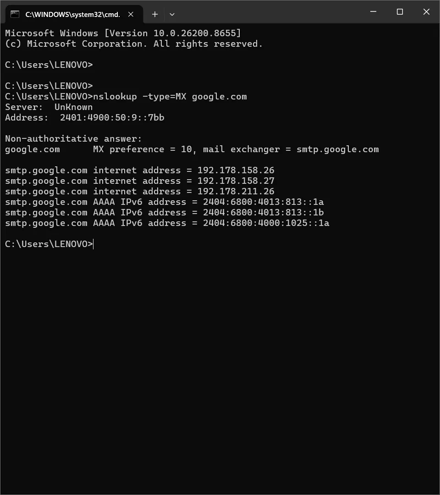
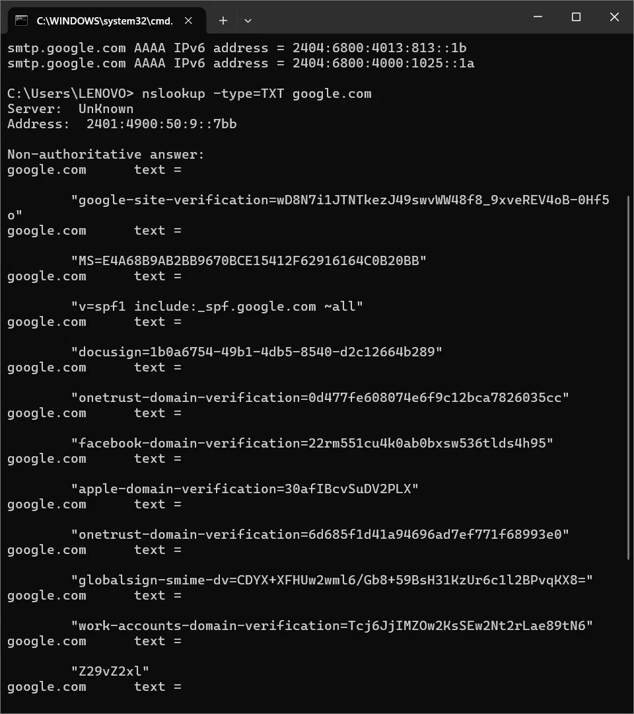
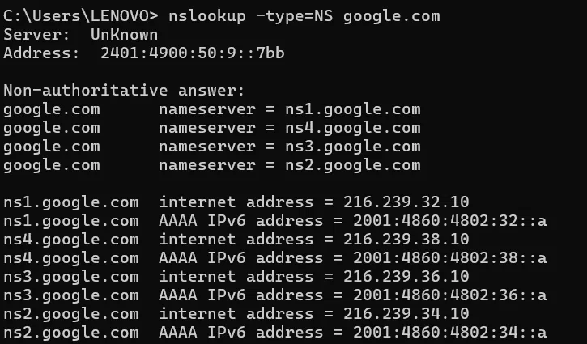

# 🌐 Day 4: DNS Deep Dive — Record Types, Zone Transfers & DNS-Based Attacks

## 🎯 Overview
This session moved beyond basic DNS resolution (A/AAAA lookups from Phase 0)
into DNS record types, the full resolution hierarchy, zone transfer risks,
and DNS-based attack techniques — connecting DNS tunneling and DGA concepts
from earlier days into one cohesive picture.

## 📚 Core Concepts

### DNS Record Types
| Record | Purpose |
|---|---|
| A / AAAA | Maps a domain to an IPv4 / IPv6 address |
| CNAME | Aliases one domain name to another |
| MX | Specifies mail servers responsible for a domain |
| NS | Specifies authoritative name servers for a domain |
| TXT | Holds text data — commonly SPF/DKIM email security records |
| PTR | Reverse lookup — IP address back to domain name |

### Full DNS Resolution Hierarchy
1. Local cache check
2. Recursive resolver queried
3. Root DNS server points to the correct TLD server
4. TLD server points to the domain's authoritative name server
5. Authoritative server returns the actual record
6. Resolver caches and returns the result to the client

### Zone Transfers (AXFR)
A zone transfer replicates an entire DNS zone between authoritative
servers for redundancy. If misconfigured to allow transfers to anyone, an
attacker can extract a complete map of an organization's subdomains,
internal hostnames, and mail servers in a single request — a significant
reconnaissance risk.

### DNS-Based Attack Techniques
- **DNS Tunneling** — smuggling data through DNS queries to bypass firewalls
- **DGA (Domain Generation Algorithm)** — malware generating pseudo-random
  domains to reach command-and-control infrastructure
- **DNS Cache Poisoning / Spoofing** — injecting a false DNS response into a
  resolver's cache, silently redirecting victims to a malicious server
- **Typosquatting** — registering lookalike domains to catch mistyped or
  unnoticed misspellings

## 🔬 Practical Work Completed

### 1. MX Record Lookup
Queried `google.com`'s mail exchange records using
`nslookup -type=MX google.com`. Identified `smtp.google.com` as the mail
server with a preference value of 10, and observed multiple IPv4/IPv6
addresses supporting the mail server for redundancy. This matters from a
SOC perspective because MX records are directly relevant when investigating
phishing infrastructure or verifying legitimate mail flow for a domain.

📷 Screenshot: MX Record Lookup — smtp.google.com

### 2. TXT Record Lookup
Queried TXT records using `nslookup -type=TXT google.com`, observing
multiple verification tokens (Google, Microsoft, Facebook, Apple, DocuSign,
OneTrust) alongside a live **SPF record**
(`v=spf1 include:_spf.google.com ~all`). Recognizing SPF records is directly
relevant to phishing investigation — SPF defines which mail servers are
authorized to send on behalf of a domain, and checking a suspicious email's
sending server against the sender domain's SPF policy is a real triage step.

📷 Screenshot: TXT Record Lookup — SPF & Verification Tokens

### 3. NS Record Lookup
Queried authoritative name servers using `nslookup -type=NS google.com`,
identifying four servers (`ns1`–`ns4.google.com`). Multiple name servers
provide redundancy, load balancing, and improved geographic response time —
preventing a single point of failure for domain resolution.

📷 Screenshot: NS Record Lookup — Authoritative Name Servers

## 🌐 Research Completed
Studied **DNS cache poisoning**, learning how false DNS data injected into
a resolver's cache can silently redirect legitimate domain requests to a
malicious server — a technique capable of enabling phishing, malware
delivery, or credential theft without any visible warning in the victim's
browser.

## 🛠 Tools Used
- **nslookup** — command-line DNS query tool used to inspect specific DNS
  record types directly against authoritative and recursive resolvers.

## 💡 Skills Gained Today
- Querying and interpreting MX, TXT, and NS DNS record types.
- Recognizing SPF records and their role in email authenticity verification.
- Understanding zone transfer risk as a reconnaissance vector.
- Connecting DNS tunneling and DGA concepts to a fuller picture of DNS as
  an attack surface.

## 📝 Revision Notes
- MX preference: lower number = higher priority.
- SPF record format: `v=spf1 include:<authorized senders> ~all`
- Zone transfer (AXFR) misconfiguration = major recon risk, not a direct exploit.
- DNS cache poisoning ≠ DNS tunneling — poisoning redirects, tunneling exfiltrates.

## 📈 Today's Progress
- Learned all major DNS record types and their real-world purpose.
- Traced the full DNS resolution hierarchy from cache to authoritative server.
- Ran and interpreted three distinct `nslookup` record-type queries against a live domain.
- Identified a real SPF record in captured output and explained its security relevance.
- Researched DNS cache poisoning and its real-world consequences.
- Completed Day 4 homework with a perfect score.

## ✅ SOC Analyst Relevance
DNS logs are frequently the first data source to reveal compromise —
malware must resolve its C2 domain before establishing contact. Analysts
watch for abnormal query volume, DGA-style domains, unusual TXT record
queries (a tunneling indicator), and unauthorized zone transfer attempts
against internal DNS infrastructure.
