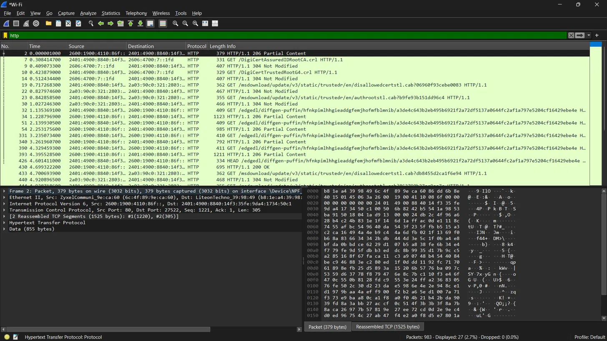
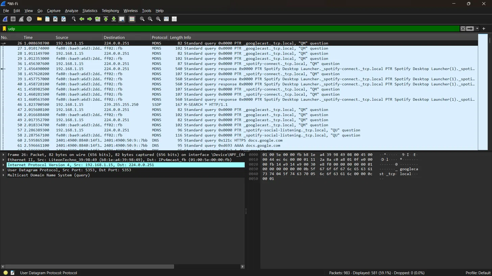
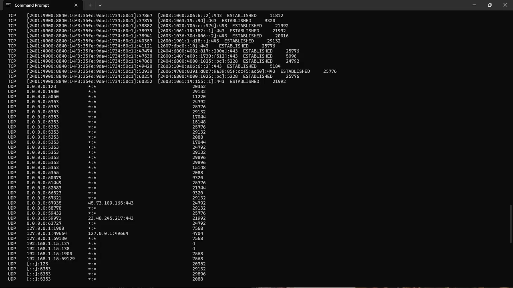

# 🌐 Day 5: TCP vs UDP Deep Dive — Protocol Behavior in Wireshark

## 🎯 Overview
This session compared TCP and UDP at a mechanical level — connection
establishment, reliability guarantees, and how each protocol's behavior
appears distinctly in live packet captures — along with real traffic
profiles for HTTP, FTP, and SSH.

## 📚 Core Concepts

### TCP vs UDP — Core Philosophy
TCP is connection-oriented, requiring a handshake before data transfer and
guaranteeing reliable, ordered delivery — suited for traffic where accuracy
matters (web browsing, file transfer, email). UDP is connectionless, with
no handshake and no delivery guarantee, trading reliability for speed —
suited for traffic like DNS, streaming, and VoIP, where minor loss is
preferable to delay.

### Protocol Traffic Profiles
- **HTTP** — TCP-based, fully plaintext; requests, response paths, and
  status codes are directly readable in a packet capture.
- **HTTPS** — TCP-based with a TLS layer; only connection metadata and SNI
  are visible, actual content is encrypted.
- **FTP** — TCP-based, transmits credentials in plaintext by default, a
  known and persistent security weakness.
- **SSH** — TCP-based, encrypted from early in the connection using its own
  key exchange mechanism (Diffie-Hellman/ECDH) rather than TLS, generating
  a shared secret used to derive symmetric session encryption keys.

### Why UDP Enables Source-IP Spoofing
Because UDP has no handshake, a receiving server has no way to verify a
packet's source IP before responding — it simply trusts the stated source
and replies to it. TCP's three-way handshake prevents this by design: a
spoofed client would never receive the server's SYN-ACK and therefore could
not complete the handshake, making TCP connection spoofing far more
difficult than UDP-based spoofing.

## 🔬 Practical Exercises

### 1. Capturing Plaintext HTTP Traffic
Filtered a live capture using `http` and observed multiple fully readable
plaintext requests, including certificate revocation checks
(`GET /DigiCertAssuredIDRootCA.crl`) and Windows Update resource requests,
along with visible HTTP status codes (`200 OK`, `304 Not Modified`).
Confirmed that under HTTPS, none of these request paths or status codes
would have been visible — only connection metadata and SNI. This
demonstrated that legitimate, modern services still use unencrypted HTTP
for certain background resources.

📷 Screenshot: Plaintext HTTP Requests

### 2. Capturing UDP Traffic (mDNS)
Filtered using `udp` and observed live Multicast DNS (mDNS) traffic,
including device discovery queries such as `_googlecast._tcp.local` and
`_spotify-connect._tcp.local`. Confirmed no handshake-like pattern preceded
data transmission, consistent with UDP's connectionless design — a clear
visual contrast to the TCP handshake captured in an earlier session.

📷 Screenshot: UDP / mDNS Traffic Capture

### 3. Reviewing UDP Connections (`netstat -ano`)
Reviewed UDP entries in `netstat` output and confirmed the absence of a
connection "state" value, unlike TCP entries which show states such as
`ESTABLISHED`. This reflects UDP's lack of a connection lifecycle — there
is no concept of a connection state to track for a protocol with no formal
session establishment or teardown.

📷 Screenshot: netstat UDP Connections

## 🌐 Research: UDP-Based DDoS Amplification Attacks
Attacks such as DNS and NTP amplification exploit UDP's lack of source
verification: an attacker sends a small request to a public server with the
victim's IP spoofed as the source, and the server sends a much larger
response directly to the victim, overwhelming their bandwidth. This attack
is specifically UDP-dependent, since TCP's handshake would prevent a
spoofed source from ever completing a connection.

## ✅ SOC Analyst Relevance
- Recognizing plaintext protocols (HTTP, FTP) still in active use is itself
  a valid finding — these represent real risk in a modern network.
- Distinguishing normal UDP background noise (mDNS, DNS) from abnormal
  patterns (unexplained high-volume UDP to a single external IP) is key to
  spotting amplification-style attacks or unusual C2 channels.
- TCP traffic missing a proper handshake pattern is a red flag for crafted
  or spoofed packets.

## 💡 Key Takeaways
- TCP prioritizes reliability via a handshake and ordered delivery; UDP
  prioritizes speed with no such guarantees. 
- SSH secures its session using its own key exchange (Diffie-Hellman/ECDH),
  independent of TLS.
- UDP's lack of a handshake is the exact mechanical reason it enables
  source-IP spoofing and amplification attacks, while TCP's handshake
  inherently resists this.
- Not all modern traffic is encrypted — plaintext HTTP is still observable
  even from legitimate services.
