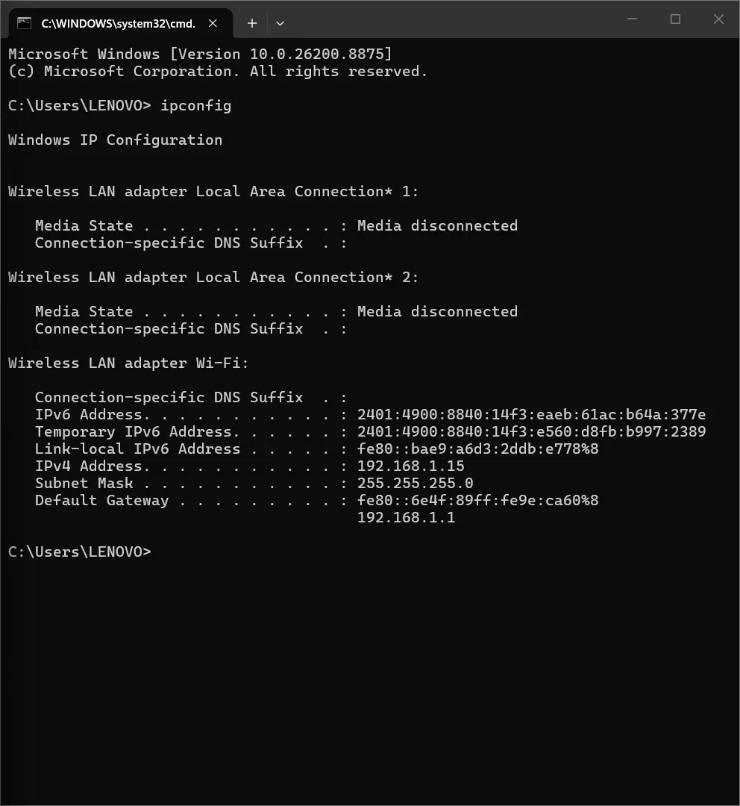
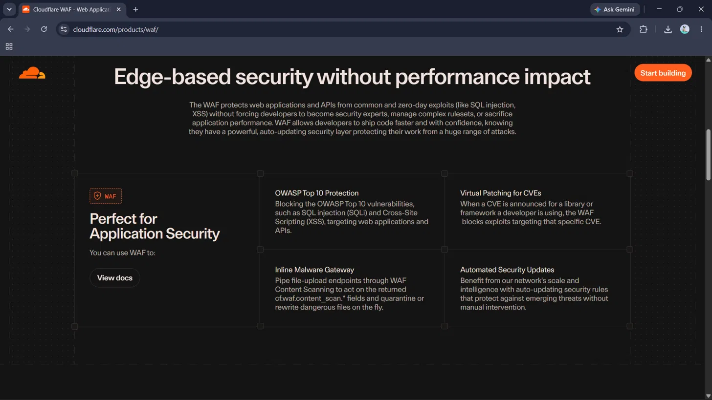

# 🔥 Phase 1 — Day 6: Firewalls, Proxies & Load Balancers

## 🎯 Overview
This session covered the core network traffic-control devices — firewalls,
proxies, and load balancers — focusing on *what* each device does, *what*
it logs, and critically, *where it sits* in the traffic path, since
placement determines what an analyst can and cannot see during an
investigation.

## 📚 Core Concepts

### 🛡️ Firewalls
- **Packet-filtering firewall (Layer 3/4)** — evaluates each packet in
  isolation using IP, port, and protocol rules, with no awareness of
  connection state. This gap can be exploited by techniques like a
  **TCP ACK scan**, which may pass through undetected since it only checks
  packet headers.
- **Stateful firewall (Layer 3/4+)** — tracks the full lifecycle of a
  connection and blocks packets that don't belong to a valid, established
  session, catching exactly what a packet-filtering firewall misses.
- **WAF / Next-Gen Firewall (Layer 7)** — inspects actual application
  content (HTTP headers, request bodies) to detect attacks like SQL
  injection and XSS — visibility a Layer 3/4 device structurally cannot
  provide.

### 🔀 Proxies
- **Forward proxy** — sits in front of clients, monitoring and controlling
  outbound traffic (e.g., a corporate proxy logging which sites employees
  visit).
- **Reverse proxy** — sits in front of servers, receiving and forwarding
  incoming requests while often hiding the backend server's real IP.

### ⚖️ Load Balancers
Distribute incoming traffic across multiple backend servers to prevent
overload — the mechanism behind DNS queries (like Google's) returning
multiple IP addresses for a single domain.

### 🕵️ Why Placement Matters for Investigation
A reverse proxy sitting in front of a web server can cause backend logs to
show **one single IP (the proxy's)** making thousands of requests — even
though real traffic came from thousands of distinct users. Without a
correctly configured `X-Forwarded-For` header, an analyst investigating an
"attack from IP X" may actually be looking at the proxy's own address,
misidentifying it as the attacker and losing the real client IP entirely.

## 🔬 Practical Exercises

### 1️⃣ Home Router Firewall Research
Reviewed local network configuration via `ipconfig` to identify the
default gateway (home router), then researched typical consumer router
firewall behavior — confirmed that most routers rely on **NAT (Network
Address Translation)** and **SPI (Stateful Packet Inspection)** by default
to block unsolicited inbound traffic while allowing outbound connections
initiated from inside the network.

📷 Screenshot: ipconfig — Default Gateway (Router)

### 2️⃣ Real-World WAF Research (Cloudflare)
Researched Cloudflare's WAF product to identify concrete attack categories
a real, named WAF product defends against: SQL Injection, Cross-Site
Scripting (XSS), Remote Code Execution, CSRF, directory traversal, bot
attacks, HTTP flood attacks, and zero-day exploits — mapped directly to
OWASP Top 10 vulnerability categories.

📷 Screenshot: Cloudflare WAF Product Overview

## 🌐 Research: X-Forwarded-For Header
The `X-Forwarded-For` (XFF) header preserves a client's original IP address
when traffic passes through a reverse proxy or load balancer. A standardized
alternative, the `Forwarded` header, also exists but is less commonly
implemented. Without correct XFF configuration, backend logs only show the
proxy's IP — directly obscuring the real source of malicious traffic during
an investigation.

## 🧑‍💻 SOC Analyst Relevance
- 🔍 A firewall's logs show what was allowed/blocked — not *why* something
  looked malicious; that requires Layer 7 visibility.
- 📥 Forward proxy logs are ideal for investigating "what did this
  compromised device try to reach?"
- ⚠️ Always verify `X-Forwarded-For` / `Forwarded` headers before concluding
  a proxy IP is the actual attacker.

## 💡 Key Takeaways
- Firewall sophistication scales with visibility: packet-filtering (L3/4) →
  stateful (L3/4 + session awareness) → WAF (L7, content-aware).
- Forward proxies protect/monitor clients; reverse proxies protect/monitor
  servers.
- Device placement in the network directly determines what its logs can
  reveal — and what they can accidentally hide.
- Real-world WAF products map their protections directly to OWASP Top 10
  categories.
