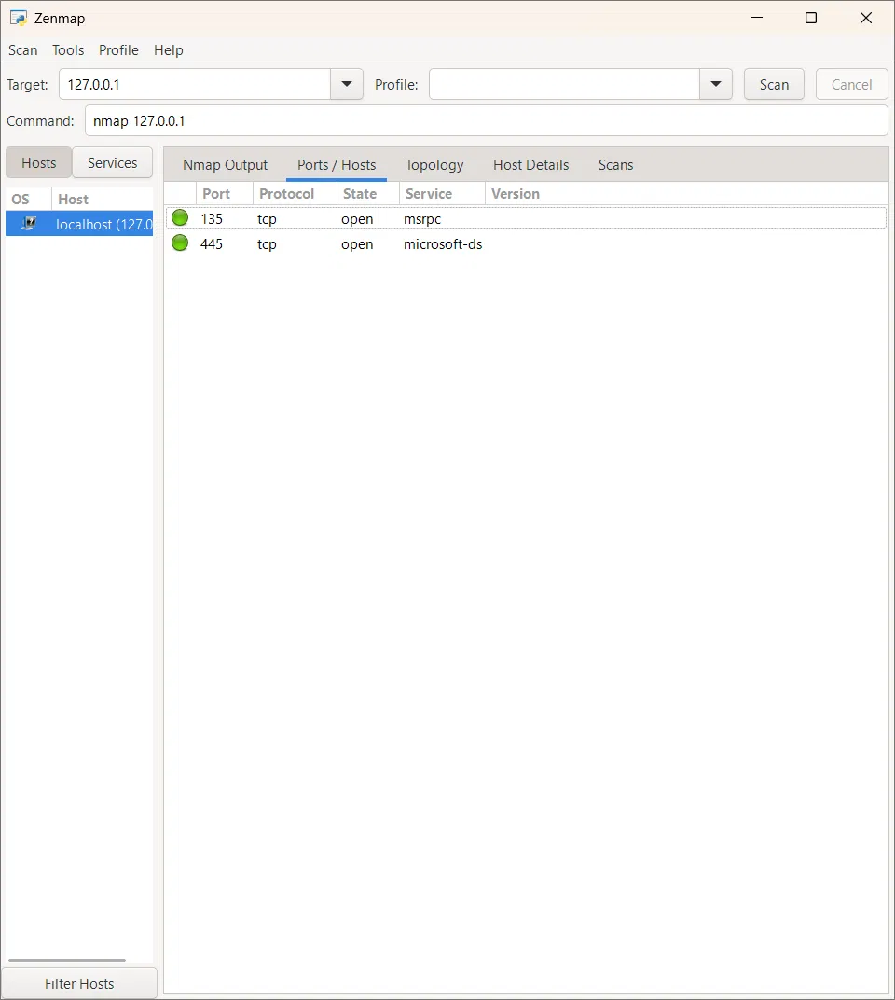
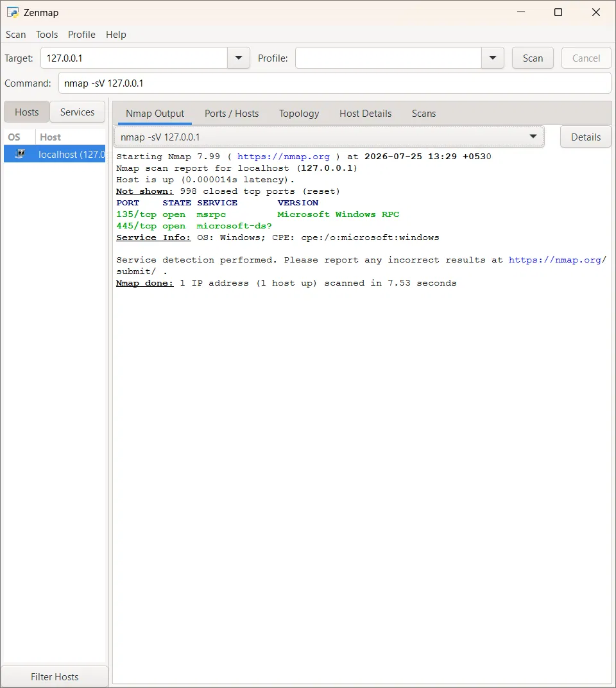
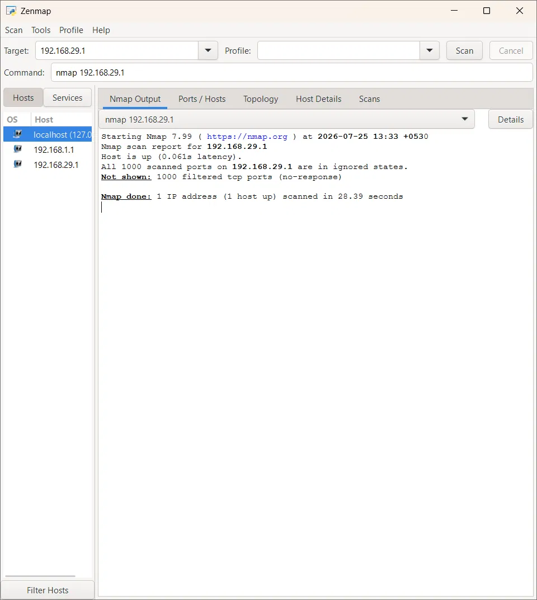

# 🔍 Day 9: Network Scanning Fundamentals — Nmap

## 🎯 Overview
This session covered Nmap's core scanning mechanics — how different scan
types exploit TCP/UDP protocol behavior to determine port states — tying
together port knowledge (Day 2), handshake mechanics (Day 2), firewall
behavior (Day 6), and UDP's connectionless nature (Day 5) into a single
practical reconnaissance tool.

## 📚 Core Concepts

### 🔎 Core Scan Types
- **TCP Connect Scan (`-sT`)** — completes the full 3-way handshake with
  each target port; reliable but "loud," since a real connection is
  established and typically logged.
- **SYN / Half-Open Scan (`-sS`)** — sends a SYN, and on receiving a
  SYN-ACK, responds with RST instead of completing the handshake —
  stealthier, since no full connection is ever established or logged.
- **UDP Scan (`-sU`)** — inherently ambiguous due to UDP's lack of a
  handshake: no response could mean open, filtered, or simply dropped; an
  ICMP Port Unreachable message is the only definitive "closed" signal.
- **Service/Version Detection (`-sV`)** — sends targeted probes to
  identify the specific service and version running on an open port,
  including OS fingerprinting via CPE identifiers.

### 🚦 Port States
| State | Meaning |
|---|---|
| **Open** | A service is actively listening and responding |
| **Closed** | Reachable, but nothing is listening (RST received) |
| **Filtered** | Nmap cannot determine state — a firewall/ACL is silently blocking probes |

## 🔬 Practical Exercises

### 1️⃣ Basic Localhost Scan
Ran a default Nmap scan (via Zenmap) against `127.0.0.1`, identifying two
open TCP ports: **135 (msrpc)** and **445 (microsoft-ds/SMB)** — standard
Windows inter-process and file-sharing services. Notably, port 445 is the
same SMB port flagged earlier (Day 2) as a common ransomware attack
target, though harmless in this loopback context.

📷 Screenshot: Nmap Basic Scan — Localhost

### 2️⃣ Service/Version Detection Scan
Ran `nmap -sV 127.0.0.1`, revealing additional detail beyond the basic
scan: specific service versions (Microsoft Windows RPC) and an OS
fingerprint via CPE identifier (`cpe:/o:microsoft:windows`) — information
unavailable from a basic port scan alone.

📷 Screenshot: Nmap Service/Version Detection Scan

### 3️⃣ Own Router Scan (Authorized Target Only)
Scanned the home router's default gateway IP, with all 1,000 scanned ports
returning **filtered** — a textbook example of a properly configured
consumer firewall (NAT + SPI, per Day 6) silently dropping unsolicited
scan traffic rather than responding, confirming appropriate security
posture on owned infrastructure.

📷 Screenshot: Nmap Scan — Router (All Ports Filtered)

## 🌐 Research: Legal & Ethical Boundaries
Scanning networks or devices without explicit ownership or permission is
treated as unauthorized reconnaissance activity under most computer
misuse/cybercrime laws, since it's frequently a precursor step before an
actual attack. Ethical practice restricts scanning strictly to owned
systems or environments with explicit written authorization.

## 🧑‍💻 SOC Analyst Relevance
- 📡 A single source IP rapidly touching many ports across many hosts in a
  short window is a classic port scan signature, regardless of the tool
  used.
- 🕵️ Understanding scan mechanics (SYN vs. Connect, filtered vs. closed)
  enables correct interpretation of vague firewall/IDS "possible scan
  detected" alerts.
- ⚖️ Nmap is dual-use — identical to Aircrack-ng and Ettercap — legitimate
  for defenders, but requires the same authorization boundaries as any
  other reconnaissance tool.

## 💡 Key Takeaways
- SYN scans are stealthier specifically because they avoid completing (and
  therefore logging) a full TCP connection.
- UDP scanning's ambiguity is a direct consequence of UDP having no
  handshake to confirm delivery or state.
- A "filtered" result reflects the target's active security posture, not
  scan failure.
- Scanning without authorization crosses real legal boundaries, not just
  ethical ones.
