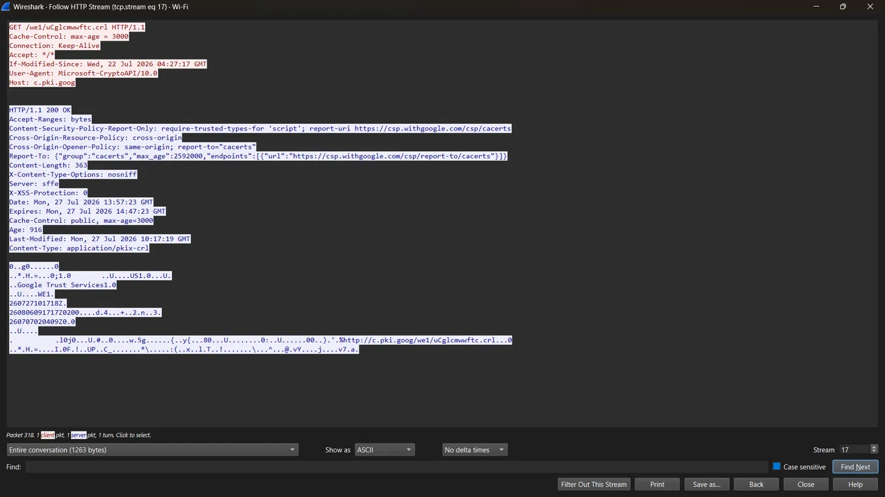
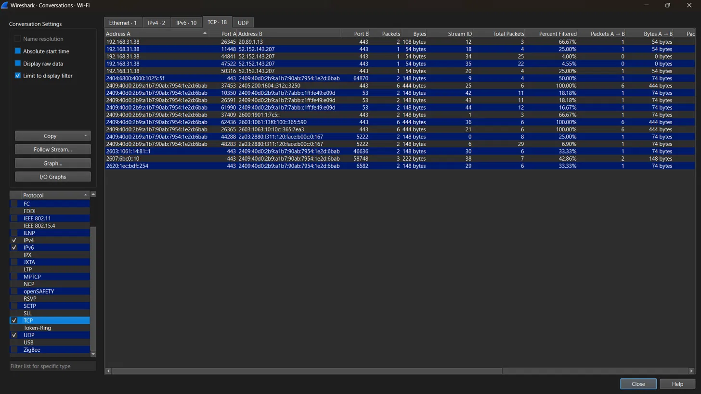
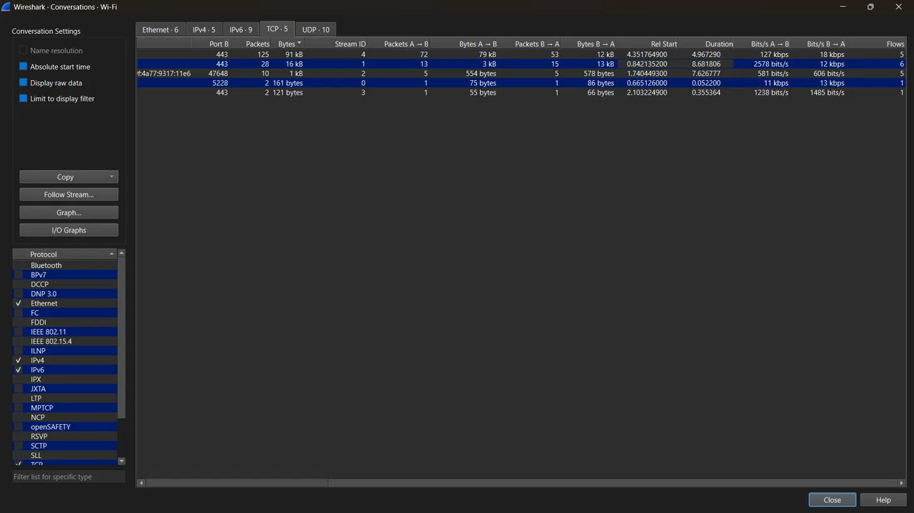

# 🔬 Day 10: Packet Analysis Deep Dive — Conversations & TCP Streams

## 🎯 Overview
This session moved beyond identifying individual packets into reconstructing
full network conversations — using Wireshark's Follow Stream and
Conversations tools to investigate connections end-to-end, and reading
proper TCP connection teardown behavior.

## 📚 Core Concepts

### 🧵 Follow TCP/HTTP Stream
Reassembles every packet belonging to one connection into a single readable
exchange — client and server content shown together, exactly as the
application-layer conversation occurred. Especially powerful for plaintext
protocols (HTTP, FTP, Telnet), where full requests, headers, and responses
become directly readable.

### 📊 Conversations Window (Statistics → Conversations)
Summarizes every distinct conversation in a capture by packet count, byte
totals, and **duration** — the fastest way to triage a large capture and
identify the "loudest" or longest-running connections worth investigating
first, rather than scrolling packet-by-packet.

### 🔚 TCP Connection Teardown
A graceful closure follows a FIN/ACK exchange on both sides — mirroring the
handshake structure from Day 2, but in reverse. An abrupt **RST**
termination instead discards any unsent data and typically signals a
crashed application, forced closure, or abnormal disconnect.

### 📡 Beaconing
A small, perfectly regular communication pattern (e.g., exactly every hour)
between a compromised host and an external server is a classic
Command-and-Control (C2) beaconing signature — the *regularity* of the
interval is itself a detection signal, since normal user traffic is
inherently irregular, even when the actual data volume looks harmless.

## 🔬 Practical Exercises

### 1️⃣ Following an HTTP Stream
Used Follow → HTTP Stream to reconstruct a real plaintext exchange with
`c.pki.goog` (Google's Certificate Revocation List service) — a
`Microsoft-CryptoAPI` request checking certificate revocation status.
Full request headers (`User-Agent`, `Host`, `If-Modified-Since`) and the
complete `200 OK` response were directly readable, reinforcing why HTTPS
is necessary for protecting sensitive exchanges.

📷 Screenshot: Follow HTTP Stream — CRL Request/Response

### 2️⃣ Identifying the Top Talker via Conversations
Reviewed the full (unfiltered) TCP Conversations table and identified the
single largest conversation by data volume: **91 kB transferred** between
the local host and a remote server on port 443, over a real duration of
**4.97 seconds** — confirmed using the dedicated Duration column rather
than estimation.

📷 Screenshot: Conversations — Top Talker by Bytes/Duration

### 3️⃣ Confirming Graceful Connection Closure
Filtered using `tcp.flags.fin==1` and confirmed multiple genuine FIN/ACK
closure pairs across different connections, including matched
request/response teardown sequences — along with a few retransmitted FIN
packets, consistent with normal retransmission behavior (Day 5) applied
to connection-closing packets.

📷 Screenshot: FIN/ACK Graceful Connection Closure

## 🌐 Research: Beaconing & C2 Detection
Beaconing describes the periodic check-in communication between compromised
malware and its C2 server. Even when the exchanged payload is minimal and
appears harmless, a highly consistent timing interval is itself a strong
detection signal, since legitimate user-driven traffic rarely follows such
mechanically regular patterns.

## 🧑‍💻 SOC Analyst Relevance
- 🔎 Following a full stream lets an analyst read the actual content of a
  plaintext exchange — not just infer it from headers.
- 📈 The Conversations view enables fast triage of large captures by
  surfacing the highest-volume or longest-running connections first.
- ⏱️ Regular-interval, low-volume connections are a key beaconing
  indicator, independent of whether the transferred data itself looks
  suspicious.
- 🔚 Distinguishing graceful (FIN/ACK) vs. abrupt (RST) connection endings
  adds meaningful context during investigation.

## 💡 Key Takeaways
- Always verify practical findings against real data (e.g., the actual
  Duration column) rather than estimating from a partial or filtered view.
- Plaintext protocol streams reveal full conversations, directly
  demonstrating the value of encryption for sensitive exchanges.
- FIN retransmissions follow the same underlying retransmission logic as
  data packet retransmissions.
- Beaconing detection relies on timing regularity as much as, or more than,
  payload content.
