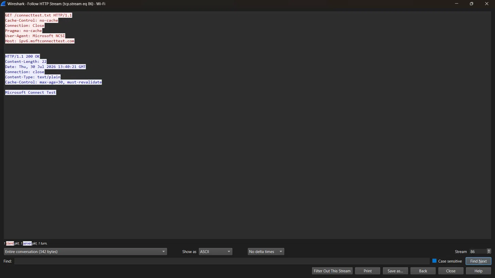
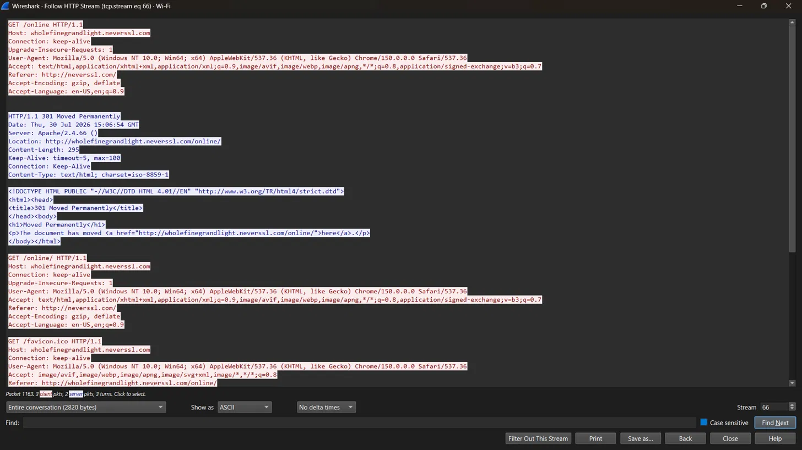

# 🕵️ Phase 1 — Day 11: HTTP Traffic Investigation — Requests, Headers & Phishing Indicators

## 🎯 Overview
This session focused on reading HTTP traffic *investigatively* — identifying
which specific request/response elements matter during a phishing or
malware investigation, rather than just recognizing HTTP as a protocol.

## 📚 Core Concepts

### 📨 Anatomy of an HTTP Request
- **Method** — GET retrieves data; POST typically submits data (credentials,
  forms) — making POST requests higher priority during investigation
- **Host header** — the domain the client believes it's contacting; can be
  spoofed or mismatched in certain attacks
- **User-Agent** — identifies client software; unusual or scripted-looking
  values can indicate automated tools rather than real users
- **Referer** — the referring page; missing/suspicious values can indicate
  direct or automated access
- **Cookie** — session tokens; exposed in full over plaintext HTTP, a real
  session hijacking risk

### 📊 HTTP Status Codes
| Range | Meaning |
|---|---|
| 2xx | Success |
| 3xx | Redirect |
| 4xx | Client error |
| 5xx | Server error |

### 🚩 Phishing Indicators in HTTP Traffic
- Typosquatted Host headers (e.g., `paypa1.com`)
- Suspicious/scripted User-Agent strings
- POST requests to unfamiliar domains following a legitimate-looking page
- Redirect chains across multiple unrelated domains — a common phishing
  and traffic-distribution-system pattern used to obscure the final
  destination and evade detection

## 🔬 Practical Exercises

### 1️⃣ Reading a Real HTTP Stream
Captured and followed a live HTTP stream showing Windows' built-in **NCSI
(Network Connectivity Status Indicator)** check:
- **Host:** `ipv6.msftconnecttest.com`
- **User-Agent:** `Microsoft NCSI`
- **Response:** `200 OK`, body containing "Microsoft Connect Test"

Confirmed this as expected, benign background traffic generated
automatically by Windows to verify network connectivity — not user-
initiated browsing.

📷 Screenshot: HTTP Stream — Windows NCSI Connectivity Check

### 2️⃣ Identifying a Benign 3xx Redirect
Captured a real `301 Moved Permanently` response while browsing
`neverssl.com`, with the `Location` header showing a canonical URL
normalization redirect (`/online` → `/online/`). Confirmed this as
expected, benign server behavior — standard trailing-slash enforcement,
not suspicious redirect-chain activity.

📷 Screenshot: HTTP 301 Redirect — Canonical URL Normalization

## 🌐 Research: Typosquatting & Host Header Manipulation
Reviewed real-world cases of typosquatting-based attacks, including a
large-scale typosquatting campaign redirecting mistyped URLs through
intermediary domains to phishing/scam pages, and a separate supply-chain
case involving typosquatted npm packages used to steal cloud credentials
and CI/CD secrets — demonstrating the same core technique applied across
different attack surfaces.

## 🧑‍💻 SOC Analyst Relevance
- 🔎 POST requests carry the highest-value data during credential-theft or
  data-exfiltration investigations.
- 🌐 Host header mismatches, combined with typosquatting, are a core
  phishing delivery mechanism.
- 🔗 Redirect chains across unrelated domains warrant scrutiny — even when
  most redirects (like canonical URL normalization) are entirely benign.
- 🧭 Distinguishing benign background/system traffic (like NCSI checks)
  from user-initiated or suspicious traffic is a practical, everyday
  triage skill.

## 💡 Key Takeaways
- Not all captured traffic is user-generated — recognizing legitimate
  background OS/system checks avoids false-positive investigation time.
- A 3xx redirect is not inherently suspicious; context (single benign
  redirect vs. multi-domain chain) determines investigative relevance.
- Real evidence must always back a finding — an assumption or placeholder
  value is not an acceptable substitute in an actual report.
