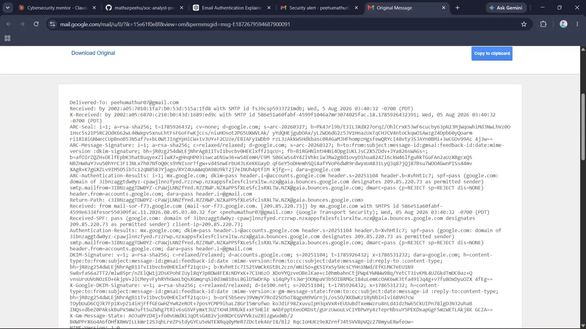
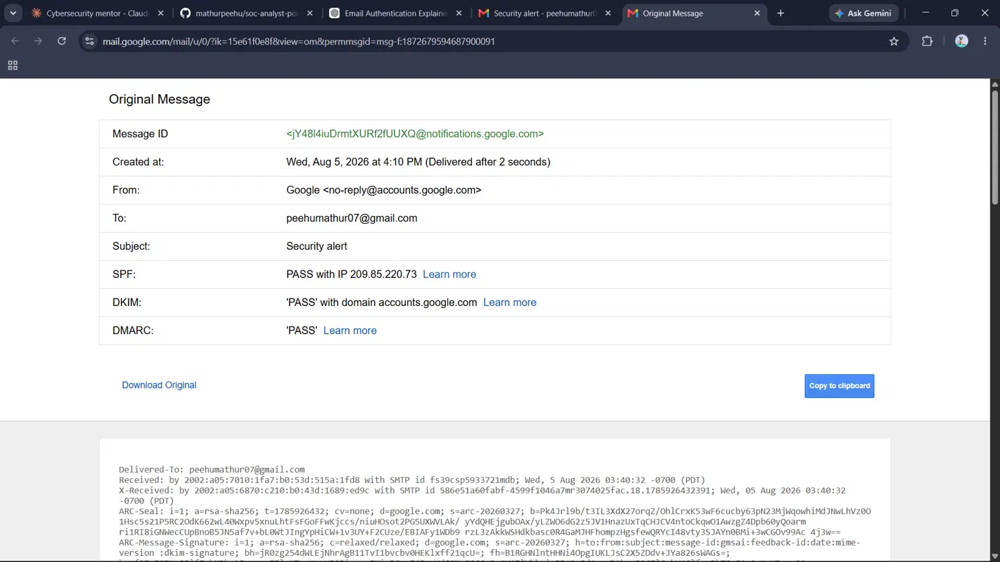

# 📧 Day 12: Email Headers & SMTP Basics — Tracing a Message's Path & Spotting Spoofed Senders

## 🎯 Overview
This session covered SMTP's fundamental trust weakness, the hidden header
trail every email carries, and the three-layer authentication system
(SPF, DKIM, DMARC) designed to close that trust gap — applied against a
real email's actual headers.

## 📚 Core Concepts

### 📤 SMTP's Root Weakness
SMTP was designed without built-in sender verification — the `From:`
field can be trivially forged. This is the same "trust without
verification" root cause identified across the entire phase: ARP replies
(Day 7), Evil Twin SSIDs (Day 9), and now email sender identity, all
exploited the same way — unless additional verification is layered on top.

### 🔍 Email Header Trail
- **`Received:`** — each mail server adds its own header, stacked newest-
  first; reading bottom-to-top reveals the message's actual path (the
  email equivalent of `tracer`)
- **`From:`** — the display sender, spoof able by default
- **`Return-Path:`** — bounce destination, can differ from the visible
  `From:` in spoofed mail
- **`Message-ID:`** — unique identifier, often containing the originating
  domain

### 🔐 The Three Authentication Mechanisms
| Mechanism | What It Checks |
|---|---|
| **SPF** | Is the sending server's IP authorized for this domain? (DNS TXT record lookup) |
| **DKIM** | Was the message content signed and unaltered? (cryptographic signature verification) |
| **DMARC** | What policy applies if SPF/DKIM fail — reject, quarantine, or none — plus reporting back to the domain owner |

DMARC specifically matters because SPF and DKIM only *check* authenticity
— they don't enforce any action on failure. DMARC is what turns passive
checks into active policy enforcement.

## 🔬 Practical Exercises

### 1️⃣ Tracing a Real Email's Received Chain
Reviewed a genuine Gmail "Show Original" header set, tracing the message
path: Google's outgoing mail server (`mail-sor-f73.google.com`) → Google's
MX server (`mx.google.com`) → final delivery to inbox — confirming the
`Received:` header stack reflects the message's real journey.

📷 Screenshot: Raw Headers — Received Chain

### 2️⃣ Reading SPF/DKIM/DMARC Authentication Results
Reviewed Gmail's summarized authentication panel for the same email,
confirming all three checks passed: SPF (authorized sending IP
`209.85.220.73`), DKIM (valid signature, domain `accounts.google.com`),
and DMARC (pass). Cross-checked the visible `From:` display against the
authenticated domain and confirmed they matched — correctly concluding
the email was legitimate, not spoofed.

📷 Screenshot: SPF/DKIM/DMARC Authentication Results

## 🌐 Research: Business Email Compromise (BEC)
Reviewed the real Google/Facebook BEC case (2013–2015), in which an
attacker impersonated a legitimate hardware supplier using fraudulent
invoices, convincing employees at both companies to wire funds to
attacker-controlled accounts — resulting in losses exceeding $100 million
before detection, with partial recovery afterward. This case illustrates
that convincing social engineering can succeed even when technical
defenses are otherwise sound, since it exploits human trust rather than
a technical gap.

## 🧑‍💻 SOC Analyst Relevance
- 📬 Reading the `Received:` chain and authentication results is one of
  the most frequent, practical tasks a junior SOC analyst performs when
  triaging reported phishing emails.
- 🚩 A failed SPF/DKIM/DMARC result is often the fastest way to flag a
  spoofed email, regardless of how convincing the visible content looks.
- 💰 BEC remains one of the costliest cybercrime categories — technical
  authentication passes don't protect against convincing human deception.

## 💡 Key Takeaways
- SMTP's spoofing vulnerability is the same root weakness pattern found
  in ARP and Evil Twin attacks: implicit trust without verification.
- SPF verifies the sending server; DKIM verifies message integrity — these
  are commonly confused but check fundamentally different things.
- DMARC is the enforcement and reporting layer, not just another check.
- Legitimate email should show matching visible `From:` and authenticated
  domain, alongside passing SPF/DKIM/DMARC results.
