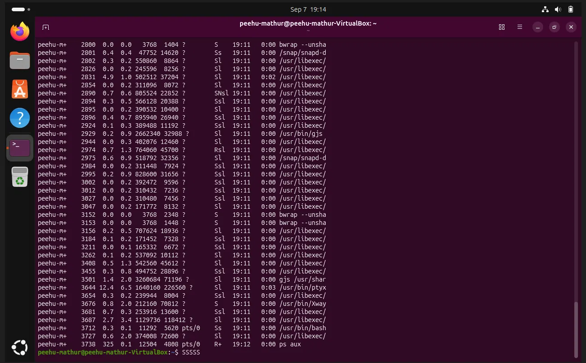
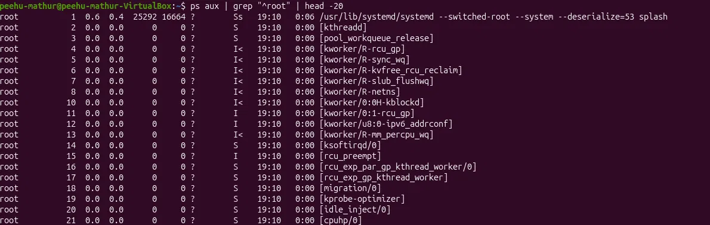
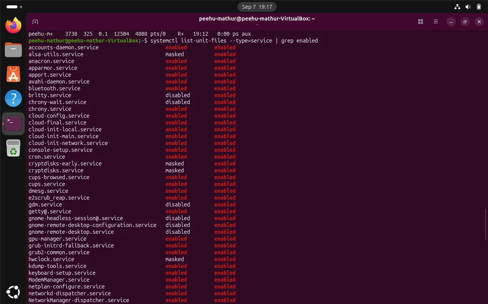
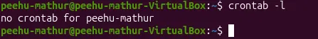

# 🐧 Day 6: Linux Processes, Services & Persistence Mechanisms

## 🎯 Overview
Investigated how Linux manages running processes and services, mapped all four
major persistence mechanisms available to attackers on Linux, and verified the
live process tree, enabled services, and cron state on a real Ubuntu VM.
Connected Linux persistence directly to the Windows persistence model from Day 4.

---

## 🔎 Viewing Running Processes

### Key Commands
```bash
ps aux                              # Snapshot of all running processes
ps aux | grep "^root" | head -20    # Filter root-owned processes only
ps aux | awk '{print $11}' | grep -E "(/tmp|/dev/shm|/home)"  # Suspicious paths
top / htop                          # Live process view
```

### 📊 ps aux Output Columns

| Column | Meaning | SOC Relevance |
|---|---|---|
| USER | Process owner | Unexpected root processes = flag |
| PID | Process ID | Cross-reference with logs |
| %CPU/%MEM | Resource usage | Crypto miners show abnormally high CPU |
| COMMAND | Full command + args | Encoded commands, unusual paths |

### 🚩 What to Look For
- Processes running as root that shouldn't be
- Commands containing base64 strings or `-enc` flags
- Processes running from `/tmp`, `/dev/shm`, or `/home`
- Processes with empty, spaced, or dot-prefixed names

### 🕵️ /proc Filesystem — Live Forensics
```bash
cat /proc/<PID>/cmdline    # Full command line (null-byte separated)
ls -la /proc/<PID>/exe     # Symlink to actual binary on disk
cat /proc/<PID>/maps       # Memory mappings — loaded libraries
```

> 💡 **Key indicator:** if malware deletes itself after execution,
> `/proc/<PID>/exe` still points to the binary shown as `(deleted)` —
> a classic post-execution forensic artefact.

---

## 🔬 Practical Evidence

<details>
<summary>🐧 ps aux — Full Process Snapshot</summary>



Live process snapshot of the Ubuntu VM. Majority of processes running as
`peehu-mathur` — GNOME desktop components, libexec helpers, snapd services.
PID 3738 (`ps aux`) is the command itself — expected.
</details>

<details>
<summary>🔐 ps aux — Root-Owned Processes (Filtered)</summary>



Command: `ps aux | grep "^root" | head -20`

Clean root process baseline confirmed:
- **PID 1** — `systemd` (init process, first started at boot, parent of everything)
- **PID 2** — `kthreadd` (kernel thread daemon, spawns all kernel threads)
- **PIDs 3–21** — kernel threads in square brackets (`[kworker/...]`,
  `[rcu_preempt]`, `[migration/0]`, etc.) — live in kernel space, always expected

No unexpected root processes. Square brackets = kernel threads = normal.
</details>

<details>
<summary>⚙️ systemctl — Enabled Services</summary>



Command: `systemctl list-unit-files --type=service | grep enabled`

All observed services are standard Ubuntu system components:
AppArmor, Bluetooth, Cron, CUPS, NetworkManager, ModemManager,
cloud-init (expected in VM environments), GNOME services.

Notable: `gnome-remote-desktop.service` — disabled but vendor-preset enabled.
On a real host (not a VM), remote desktop services warrant a second look
as they are common lateral movement targets.

No unfamiliar or suspicious service names observed — clean baseline.
</details>

<details>
<summary>📅 crontab -l — Per-User Cron State</summary>



Result: `no crontab for peehu-mathur`

Clean state confirmed — no per-user scheduled tasks configured.
An empty crontab is itself evidence: any future entry would represent
a change from this baseline.
</details>

---

## ⚙️ systemd Persistence

### 📂 Unit File Locations

| Path | Scope | Privilege Required |
|---|---|---|
| `/etc/systemd/system/` | System-wide, highest priority | Root |
| `/usr/lib/systemd/system/` | Distro-installed defaults | Root |
| `~/.config/systemd/user/` | Per-user, session-scoped | None |

### 🚨 Minimal Malicious Service Unit
```ini
[Unit]
Description=System Update Service

[Service]
ExecStart=/tmp/update.sh
Restart=always
User=root

[Install]
WantedBy=multi-user.target
```

> ⚠️ **Red flags:** ExecStart pointing to `/tmp`/`/home`; `Restart=always`
> ensuring respawn if killed; vague description designed to blend in.

### 🔍 Key Detection Commands
```bash
systemctl list-unit-files --type=service | grep enabled
systemctl cat <service-name>     # Show the actual unit file
journalctl -u <service-name>     # Service-specific logs
```

---

## ⏰ Cron Persistence

### 📂 Locations and Privilege

| Location | Scope | Privilege |
|---|---|---|
| `/etc/crontab` | System-wide | Root |
| `/etc/cron.d/` | Drop-in system files | Root |
| `/etc/cron.daily/` | Daily scripts | Root |
| `/var/spool/cron/crontabs/` | Per-user | None |

### 🚩 Red-Flag Cron Patterns
```bash
# Reboot trigger — classic persistence
@reboot /home/user/.hidden/persist.sh

# Base64-encoded command — obfuscation
*/5 * * * * bash -c "$(echo <base64> | base64 -d)"

# Staging area execution
*/5 * * * * /tmp/beacon.sh
```

---

## 📝 Shell Startup File Persistence

| File | Trigger | Privilege |
|---|---|---|
| `~/.bashrc` | Every interactive bash shell | None |
| `~/.bash_profile` / `~/.profile` | Login shells | None |
| `/etc/profile` | All users, system-wide | Root |
| `/etc/profile.d/*.sh` | System-wide drop-ins | Root |

### 🚨 Malicious .bashrc Addition
```bash
nohup /tmp/beacon.sh &>/dev/null &
```

| Component | Purpose |
|---|---|
| `nohup` | Keep process alive after terminal closes |
| `/tmp/beacon.sh` | Malicious script in staging location |
| `&>/dev/null` | Discard stdout and stderr — hide output |
| `&` | Background the process — return shell control |

---

## 🔑 SSH Authorized Keys Persistence

```bash
cat ~/.ssh/authorized_keys
```

Attacker adds their public key — grants passwordless SSH access permanently,
surviving password changes by the legitimate user.

**🕵️ Detection:** file integrity monitoring on `~/.ssh/authorized_keys`;
correlate new key additions with SSH logins from unexpected source IPs.

---

## 💾 /dev/shm vs /tmp

| Property | /tmp | /dev/shm |
|---|---|---|
| Backed by | Disk (usually) | RAM (tmpfs) |
| Write access | World-writable | World-writable |
| Execute | Default yes (unless noexec) | Default yes |
| Post-reboot recovery | Possible (disk-backed) | Very difficult (RAM-wiped) |
| Attacker advantage | Common, familiar | More volatile, harder to recover |

> 🔬 **Forensic implication:** files placed in `/dev/shm` are gone after reboot —
> making post-incident recovery significantly harder than disk-backed `/tmp`.

---

## 🖥️ Privilege Comparison: Linux vs Windows Persistence

| Linux | Windows Equivalent | Privilege Required |
|---|---|---|
| `/etc/systemd/system/` service | HKLM Run / Windows Service | Root / Admin |
| `~/.config/systemd/user/` service | HKCU Run key | None |
| Per-user crontab | User Startup folder | None |
| `/etc/crontab` | Scheduled Task (SYSTEM) | Root / Admin |
| `~/.bashrc` addition | HKCU Run key | None |

---

## ✅ Linux IR Checklist
```bash
# Processes running from suspicious paths
ps aux | awk '{print $11}' | grep -E "(/tmp|/dev/shm|/home)"

# Deleted binaries still running
ls -la /proc/*/exe 2>/dev/null | grep deleted

# All enabled services
systemctl list-unit-files --type=service | grep enabled

# All user crontabs
for user in $(cut -f1 -d: /etc/passwd); do
  echo "==$user=="; crontab -l -u $user 2>/dev/null
done

# Check startup files
ls -la ~/.bashrc ~/.profile /etc/profile.d/
```

## 💡 Key Takeaways
- PID 1 is always systemd on modern Linux — the parent of everything;
  kernel threads appear in square brackets and are always expected
- Per-user persistence (crontab, ~/.config/systemd/user/, ~/.bashrc)
  requires zero privileges — the Linux equivalent of HKCU Run
- System-wide persistence requires root — the Linux equivalent of HKLM Run
- `/dev/shm` is RAM-backed — files vanish on reboot, making forensic
  recovery much harder than disk-backed /tmp
- `nohup ... &>/dev/null &` is the standard attacker pattern for
  backgrounding a persistent process silently from a shell startup file
- An empty crontab is evidence — baseline it so changes stand out
