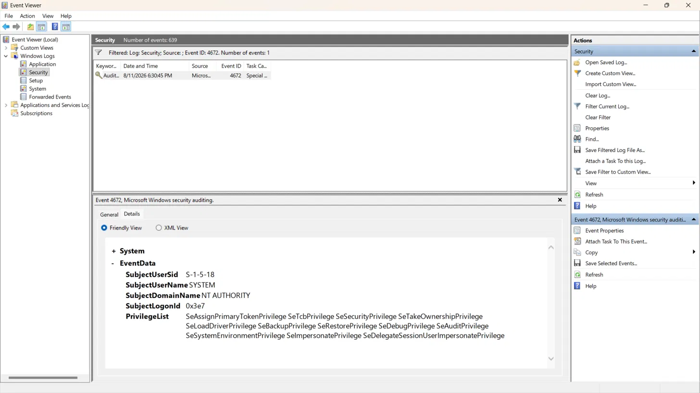
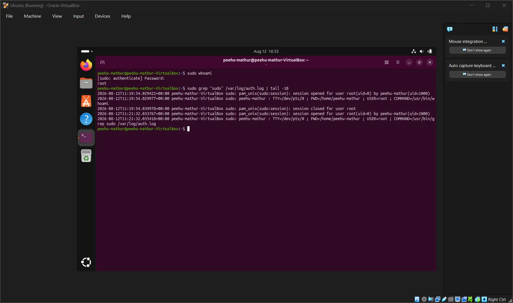

# Day 1: Kernel Mode vs User Mode (Windows & Linux) 🖥️🔐

## Overview 📚

Explored the CPU-enforced privilege boundary that underlies every OS security
model: Ring 0 (kernel mode) vs Ring 3 (user mode), how Windows and Linux each
implement it, and why this boundary is the foundation for privilege escalation
as a SOC alert category. 🚨

## Core Concept 🧠

* **Kernel mode (Ring 0):** unrestricted access to hardware, memory, all processes 🔴
* **User mode (Ring 3):** restricted; apps request privileged actions via system calls 🟢
* The boundary is enforced by the **CPU itself**, not software convention — a
  hardware ring restriction can't be bypassed by a process simply ignoring a flag,
  the way a software-only check could be. ⚙️🛡️

## Windows Implementation 🪟

* Ring 3: user-mode apps, most services
* Ring 0: `ntoskrnl.exe` + signed kernel drivers (`.sys`)
* Transitions happen via `ntdll.dll` → controlled kernel entry — this is the
  hook point EDR products monitor 👁️‍🗨️
* **LSASS case study:** user-mode process, but shielded by **Protected Process
  Light (PPL)** — access requires token/DACL match, `SeDebugPrivilege` for
  `PROCESS_VM_READ`, *and* passing the PPL check (signed driver required to bypass) 🔒

## Linux Implementation 🐧

* Ring 0: kernel space / Ring 3: user space
* Classic model: root (UID 0) vs non-root 👤
* Modern refinement: **capabilities** (e.g. `CAP_SYS_PTRACE`, `CAP_NET_ADMIN`)
  split root's power into grantable pieces 🧩
* `sudo` — controlled, logged escalation ⬆️📝

## SOC Relevance 🛡️🚨

Privilege escalation is detected via its symptoms in logs, not directly:

* **Event ID 4672** — special privileges assigned to new logon (SYSTEM firing
  this is normal noise; watch for it on a *new low-privilege interactive logon* instead) 📋
* **Event ID 4688** — process creation; watch low-priv parents spawning elevated children 👀
* **Linux `/var/log/auth.log`** — every `sudo` call, success or failure, with command 📝

Core principle: a SOC analyst notices when a process crosses a privilege boundary
it shouldn't. 🔎 This connects directly to the Phase 1 theme — **trust without
verification** — except at the OS level, verification usually *exists* and gets
*defeated*, rather than being absent. ⚠️

## Practical Evidence 🔬

Real Event ID 4672 — Security Log

SYSTEM account (`S-1-5-18`, NT AUTHORITY) with a full privilege list including
`SeDebugPrivilege`, `SeBackupPrivilege`, `SeRestorePrivilege`, `SeTakeOwnershipPrivilege`,
`SeLoadDriverPrivilege`.

Real sudo escalation — /var/log/auth.log

Ran `sudo whoami` on an Ubuntu VM; confirmed in `/var/log/auth.log` with full
PAM session open/close pair and exact command logged (`USER=root ; COMMAND=/usr/bin/whoami`). 🔐

## Research: PPL Bypass 🔬⚠️

**Mimikatz's `mimidrv.sys`** — a signed kernel driver historically used to modify
kernel structures and bypass PPL protections to reach LSASS memory. Modern
mitigations include **HVCI** and the **Microsoft vulnerable-driver blocklist policy**. 🛡️

## Key Takeaways 🎯

* The kernel/user split makes "a normal process can't read LSASS" true at a
  **hardware-enforced** level, not just a policy one. 🔒
* LSASS is protected by token/DACL/privilege checks *and* PPL as an extra layer. 🛡️
* "Trust without verification" at the OS level = a check that exists but is
  bypassed — not a check that's missing. 🔍
