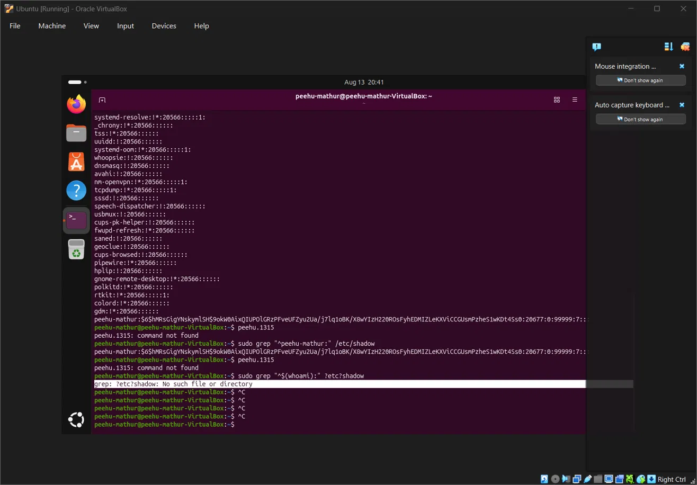
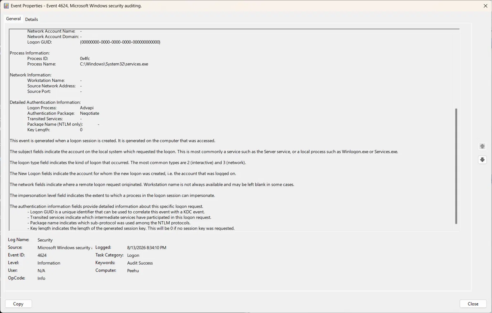

# 🛡️ Day 2: Credential Storage & Authentication Internals

## 📋 Overview
Investigated how Windows and Linux each store credentials, why plaintext 
passwords are never stored, and how authentication protocols (NTLM vs Kerberos) 
differ at the network level. Pulled real evidence from both systems to verify 
concepts hands-on.

---

## 🪟 Windows: SAM, LSA Secrets & NTLM

### 🗄️ SAM Database
- Located at `C:\Windows\System32\config\SAM`
- Stores **NTLM hashes** of local account passwords — never plaintext
- NTLM hash is derived from the password using MD4
- File is locked while Windows runs; decrypted content is held live in **LSASS memory**
  (this is why LSASS is the primary credential-dumping target — not credentials 
  in general, but live decrypted material specifically)

### 🔐 NTLM Hash Properties — SOC-Relevant
- **Unsalted:** the same password always produces the same hash on any machine
- This is what enables **pass-the-hash** — an attacker authenticates directly 
  with the stolen hash without ever needing the real password, because NTLM 
  compares hash-to-hash
- A hash-derived response crosses the network during NTLM auth — not the 
  password itself, but something that *behaves* like a credential

### 🔑 LSA Secrets
- Separate store from SAM
- Holds service account passwords, cached domain credentials, auto-logon passwords
- Encrypted under the LSA

### 🎫 Kerberos (High-Level)
- Used for domain account authentication (not SAM)
- Ticket-based: authenticate once to the KDC → receive a TGT → present service 
  tickets per resource, without re-sending a password each time
- What crosses the network: an **encrypted, time-limited, service-specific ticket** 
  — not reusable as a credential for a different service or session
- Full attack chains (Golden Ticket, Kerberoasting) deferred to AD phase

---

## 🐧 Linux: `/etc/passwd` vs `/etc/shadow`

### 🔒 Why the Split Exists
- `/etc/passwd` — world-readable; historically held the hash, now holds an `x` 
  placeholder; needed by system tools for UID/GID lookups
- `/etc/shadow` — root-readable only; holds the actual password hash + aging info
- The split ensures "readable by everyone" and "contains the secret" are never 
  the same file

### Hash Format
Entries in `/etc/shadow` follow the format: `$id$salt$hash`
- `$6$` → SHA-512 (confirmed on my own system)
- Salt is unique per user/system — two users with the same password get 
  *different* stored hashes, directly defeating pass-the-hash-style replay

---

## 🧪 Practical Evidence

🐧 /etc/shadow — SHA-512 hash entry (Ubuntu VM)

Accessed via `sudo grep "^peehu-mathur:" /etc/shadow`. Entry confirms:
- Hash algorithm: `$6$` (SHA-512)
- Unique salt present between first and second `$` delimiters
- Full derived hash follows — not plaintext, not reusable across systems due to salt

🪟 Event ID 4624 — Service Logon (Windows Security Log)

Real logon event pulled from the Security log:
- **Event ID:** 4624 (Successful Logon)
- **Logon Type:** 5 — Service logon (background, not interactive)
- **Authentication Package:** Negotiate (Windows selects appropriate protocol)
- **Process Name:** `C:\Windows\System32\services.exe` — confirms routine 
  background service logon, not a user-initiated session
- **Source Network Address:** blank — local logon, not network-originated
- **Key Length:** 0 — no session key requested, consistent with service logon

> SOC note: Logon Type 5 from `services.exe` with no network address is normal 
> background noise. The alert-worthy pattern is Logon Type 3 (network) with NTLM 
> as the auth package on accounts that normally authenticate via Kerberos.

---

## 🚨 SOC Relevance
- Any unexpected process reading `SAM`, accessing `lsass.exe` memory, or reading 
  `/etc/shadow` outside of expected system processes is a high-confidence alert
- **Event ID 4624 triage checklist:**
  - Logon Type 5 + `services.exe` → normal noise
  - Logon Type 3 + NTLM package + low-privilege account → investigate
  - Logon Type 2 (interactive) + unexpected account + 4672 fired same session → escalate
- 🐧 Linux: unexpected reads of `/etc/shadow` are auditable via `auditd` file-integrity rules

## 🧠 Key Takeaways
- LSASS is targeted because it holds **live decrypted credential material**, 
  not just references to it
- NTLM's lack of salting is a structural weakness — pass-the-hash exploits the 
  protocol design, not a misconfiguration
- Linux's salted SHA-512 (`$6$`) defeats hash-replay at the protocol level
- Kerberos improves on NTLM by putting time-limited, service-specific tickets 
  on the wire instead of reusable credential material
- "Trust without verification" continues here: NTLM trusts a hash-derived 
  response without verifying the original password was actually known
  
- Linux's salted SHA-512 (`$6$`) defeats hash-replay at the protocol level
- Kerberos improves on NTLM by putting time-limited, service-specific tickets 
  on the wire instead of reusable credential material
- "Trust without verification" continues here: NTLM trusts a hash-derived 
  response without verifying the original password was actually known
