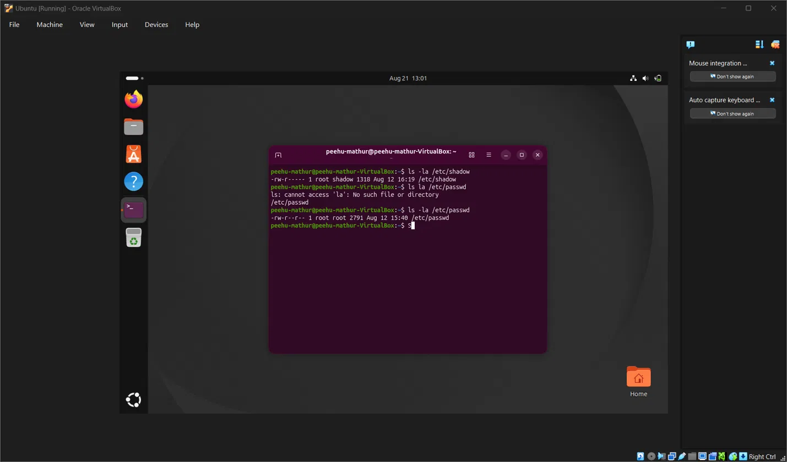
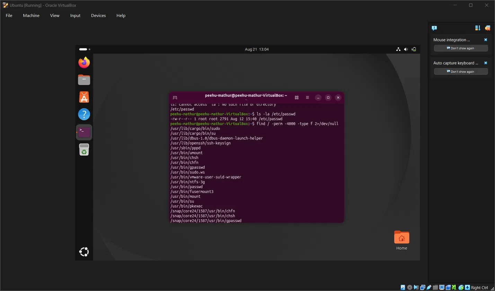

# 🐧 Phase 2 — Day 5: Linux Filesystem & Permissions for Security

## 🎯 Overview
Mapped the Linux filesystem hierarchy from a security analyst's perspective,
investigated the permission model and special bits (SUID/SGID/sticky),
identified security-critical files and their expected permission states,
and verified real permission values and SUID binaries on a live Ubuntu VM.

---

## 📁 Linux Filesystem Hierarchy — Security View

| Directory | Security Relevance |
|---|---|
| `/etc` | Config files — /etc/shadow, /etc/sudoers, SSH config, cron — high-value target |
| `/var/log` | Primary log investigation location — auth.log, syslog, audit/ |
| `/tmp` | World-writable, executable by default — classic malware staging area |
| `/home/<user>` | Shell startup files, SSH keys, bash history |
| `/root` | Root's home — SSH keys, bash history, sensitive configs |
| `/bin`, `/usr/bin` | System binaries — malware may shadow or replace these |
| `/proc` | Virtual filesystem — live process memory, cmdlines, file descriptors |
| `/lib`, `/usr/lib` | Shared libraries — library hijacking attacks target here |

**🔎 SOC investigation priority order:** `/etc` → `/var/log` → `/tmp` → `/proc`

---

## 🔐 Linux Permission Model

Every file has three permission sets and three permission types:

-rwxr-xr-- 1 root root filename
^^^|^^^|^^^
own|grp|oth


| Symbol | Name | Octal |
|---|---|---|
| r | read | 4 |
| w | write | 2 |
| x | execute | 1 |

Example: `rwxr-xr--` = Owner:7, Group:5, Others:4 → **754**

### 🚨 Security-Critical File Permissions (Verified Live)

| File | Permissions | Meaning |
|---|---|---|
| `/etc/shadow` | `-rw-r-----` (640) | Root + shadow group can read; no others |
| `/etc/passwd` | `-rw-r--r--` (644) | World-readable; root can write |

**Why the difference:** `/etc/passwd` must be world-readable for system tools
(UID/GID lookups). `/etc/shadow` holds actual password hashes — restricted
to root and shadow group only. A world-readable shadow file (644 or 777)
is an immediate critical finding.

> 💡 **Bonus observation from live system:** `/etc/shadow` group owner is `shadow`,
> not `root` — meaning shadow group membership is itself a sensitive privilege
> worth auditing on any Linux host.

---

## ⚙️ Special Permissions

### 🔑 SUID (Set User ID) — Most Important for SOC Analysts
Executable runs as the file's **owner** regardless of who launches it.
A root-owned SUID binary runs as root for any user.

```bash
# Find all SUID binaries on a system
find / -perm -4000 -type f 2>/dev/null
```

**Expected SUID binaries (confirmed on live system):**

| Binary | Why SUID | Expected? |
|---|---|---|
| `/usr/bin/passwd` | Updates protected account files on behalf of user | ✅ Expected |
| `/usr/bin/sudo` | Elevates privileges for authorised users | ✅ Expected |
| `/usr/bin/su` | Switches user account after authentication | ✅ Expected |

> ⚠️ **Alert:** any SUID binary in `/tmp`, `/home`, or custom non-system paths
> is a high-confidence privilege escalation indicator.

### 👥 SGID — runs as file's group
### 📌 Sticky Bit — on `/tmp`; prevents users deleting each other's files

---

## 🗑️ /tmp — Why Attackers Use It

Three properties that make `/tmp` attractive as a staging area:
1. **World-writable** — any user can create files without admin privileges
2. **Executable by default** — files can be run directly from /tmp
   (hardened systems use `noexec` mount option to counter this)
3. **Auto-cleaned** — files may be removed on reboot, reducing forensic traces

> 🕵️ **SOC note:** unexpected executables or scripts in `/tmp` with execute permissions
> are a high-confidence initial-access or staging indicator.

---

## 📋 Security-Critical Files Reference

| File | Purpose | Attacker Interest |
|---|---|---|
| `/etc/shadow` | Password hashes | Credential access |
| `/etc/sudoers` | Sudo privilege config | Privilege escalation |
| `/etc/crontab` | System cron jobs | Persistence |
| `/var/spool/cron/` | Per-user cron jobs | Persistence |
| `~/.ssh/authorized_keys` | SSH public keys | Backdoor access |
| `~/.bashrc`, `~/.profile` | Shell startup | User-level persistence |
| `/root/.bash_history` | Root command history | Forensic evidence |

### ⚠️ /etc/sudoers — Dangerous Configurations
Dangerous — effectively passwordless root

user ALL=(ALL) NOPASSWD: ALL

Also dangerous — vim gives shell escape

user ALL=(ALL) NOPASSWD: /usr/bin/vim

Any `NOPASSWD: ALL` for a non-system account = critical finding.

---

## 🔬 Practical Evidence

<details>
<summary>🐧 /etc/shadow & /etc/passwd — Permission Strings Verified</summary>



/etc/shadow → -rw-r----- root shadow
/etc/passwd → -rw-r--r-- root root


- shadow: only root and shadow group members can read — correct, expected
- passwd: world-readable by design — needed for UID/GID lookups
- shadow group (not root group) on /etc/shadow = shadow group membership
  is itself a sensitive privilege on this system
</details>

<details>
<summary>🔍 SUID Binary Search — find / -perm -4000</summary>



Command: `find / -perm -4000 -type f 2>/dev/null`

All results are standard system SUID binaries in expected paths
(`/usr/bin/`, `/usr/sbin/`, `/usr/lib/`). No unexpected SUID binaries
found in /tmp, /home, or custom locations — clean baseline confirmed.

Notable entries: passwd, sudo, su, mount, umount, ssh-keysign, pkexec,
vmware-user-suid-wrapper (VMware tools — expected in VM environment).
</details>

---

## 🧑‍💻 SOC Detection — Linux

| What to Monitor | Where | Alert If |
|---|---|---|
| Reads to `/etc/shadow` | auditd | Any unexpected process reads shadow |
| New SUID binaries | find / -perm -4000 | Anything outside /usr/bin, /usr/sbin |
| New cron entries | /etc/cron*, /var/spool/cron/ | Unexpected or obfuscated commands |
| SSH key additions | ~/.ssh/authorized_keys | New key added outside normal workflow |
| Files in /tmp with +x | ls -la /tmp | Executables dropped in /tmp |
| Sudoers changes | /etc/sudoers, auditd | NOPASSWD added for non-system account |

### 🛡️ auditd Rule — Detecting /etc/shadow Reads
```bash
-w /etc/shadow -p r -k shadow_read
```

| Flag | Meaning |
|---|---|
| `-w /etc/shadow` | Watch this file for activity |
| `-p r` | Trigger on read access |
| `-k shadow_read` | Tag events with searchable key |

Search for events: `ausearch -k shadow_read`
Any hit outside of expected system processes = credential-access indicator.

### 📜 Key Log Files for Linux IR

/var/log/auth.log # Authentication, sudo, SSH, PAM
/var/log/syslog # General system events
/var/log/audit/audit.log # auditd — file access, syscalls, process execution
/root/.bash_history # Root command history (if not cleared by attacker)


---

## 💡 Key Takeaways
- Linux filesystem has predictable structure — SOC analysts need to know
  which directories matter and what "normal" looks like before investigating
- Permission strings are readable at a glance: shadow (640) vs passwd (644)
  tells you the entire access story in six characters
- SUID is legitimate on system binaries — unexpected SUID anywhere outside
  `/usr/bin` or `/usr/sbin` is a high-confidence escalation indicator
- `/tmp` is world-writable and executable by default — first place to check
  for dropped malware on a compromised Linux host
- auditd fills the gap auth.log leaves: file-level read/write/execute
  monitoring with searchable keys is the Linux equivalent of Sysmon
- Linux persistence (prediction from Day 4 confirmed): systemd services,
  cron, shell startup files, authorized_keys — all verified as real vectors
