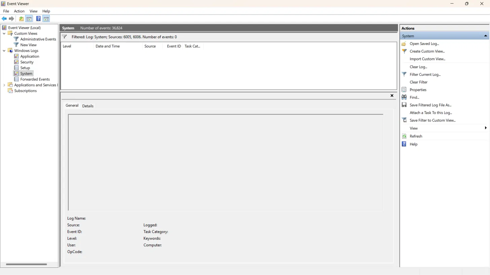
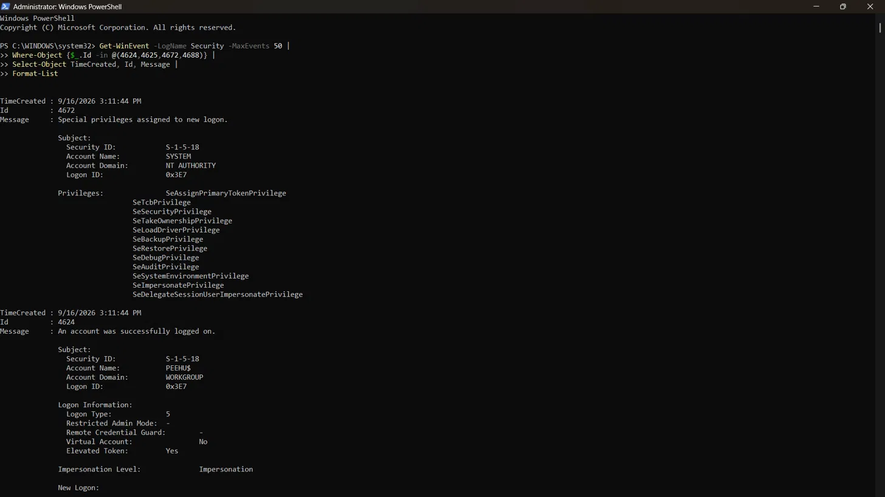

# 📋 Day 7: Windows Event Log Architecture & Forensic Log Analysis

## 🎯 Overview
Studied how Windows Event Logging works at an architectural level — providers,
log structure, audit policy dependencies — and built a consolidated SOC reference
for the Event IDs accumulated across Phase 2. Practised reading a full attack
timeline as an event sequence, and verified real log evidence on a live system.

---

## 🏗️ How Windows Event Logging Works

Events are generated by **providers** — OS components, drivers, applications
registered to emit events. The Event Log service (`eventlog`) collects and
writes them to `.evtx` files:

C:\Windows\System32\winevt\Logs\


### 📦 Every Event Contains

| Field | Meaning |
|---|---|
| EventID | What happened |
| TimeCreated | UTC timestamp — critical for timeline reconstruction |
| Provider | Which component generated it |
| Computer | Which machine (important in domain environments) |
| Channel | Which log (Security, System, etc.) |
| EventData | The actual content — varies by EventID |

---

## 📚 The Four Core Logs

| Log | Source | Key Contents |
|---|---|---|
| **Security** | Windows Security Auditing (LSASS) | Logon, privilege use, process creation, object access |
| **System** | OS and service components | Service starts/stops, driver failures, reboots |
| **Application** | Installed applications | Crashes, errors — quality varies by app |
| **Sysmon/Operational** | Sysmon driver (if deployed) | Process, network, registry, DLL, file events |

---

## 🔐 Audit Policy — Why Events Don't Just Appear

Security log events only fire if the corresponding audit category is enabled.
Two identical machines can have completely different log coverage depending
on their audit configuration.

Group Policy → Computer Configuration → Windows Settings →
Security Settings → Advanced Audit Policy Configuration


| Category | Key Event IDs |
|---|---|
| Logon/Logoff | 4624, 4625, 4634 |
| Privilege Use | 4672 |
| Process Creation | 4688 |
| Object Access | 4656, 4657, 4663 |
| Account Management | 4720, 4732 |
| Policy Change | 4719 |

> 💡 **4719** is self-referential — if an attacker disables audit policy,
> 4719 fires before the change takes effect, logging the tampering attempt.

---

## 🗂️ Phase 2 Consolidated Event ID Reference

### 🔑 Authentication & Logon

| ID | Meaning | Alert Pattern |
|---|---|---|
| 4624 | Successful logon | Type 3 + NTLM on Kerberos-only account |
| 4625 | Failed logon | Many failures = brute force; one before 4624 = stuffing |
| 4634 | Logoff | Short gap between 4624/4634 = quick in-and-out |
| 4672 | Special privileges assigned | On interactive logon for low-privilege account |

### ⚙️ Process & Execution

| ID | Meaning | Alert Pattern |
|---|---|---|
| 4688 | Process created | Office → cmd.exe; svchost without -k; encoded PowerShell |
| 4689 | Process terminated | Correlate with 4688 for session duration |

### 👤 Privilege & Account

| ID | Meaning | Alert Pattern |
|---|---|---|
| 4720 | User account created | Outside normal provisioning hours |
| 4732 | User added to security group | Added to Administrators unexpectedly |
| 4719 | Audit policy changed | Any change = possible evidence-tampering attempt |

### 🗝️ Object & Registry

| ID | Meaning | Alert Pattern |
|---|---|---|
| 4657 | Registry value modified | Run keys, Services, Winlogon — requires Object Access auditing |
| 4663 | Object access attempt | Sensitive file accessed — requires SACL on object |

### 🛠️ Service & System

| ID | Meaning | Alert Pattern |
|---|---|---|
| 7045 | New service installed | Binary path outside System32 |
| 6005 | Event log service started | After unexpected reboot |
| 6006 | Event log service stopped | With 1102 = log clearing sequence |
| 1102 | Security audit log cleared | High-confidence attacker action |

### 🔬 Sysmon (if deployed)

| ID | Meaning |
|---|---|
| 1 | Process creation (full command line) |
| 3 | Network connection |
| 7 | Image/DLL loaded |
| 8 | CreateRemoteThread — injection |
| 10 | ProcessAccess — credential theft |
| 11 | File created |
| 13 | Registry value set |
| 22 | DNS query |

---

## 🧩 Reading a Full Attack Timeline

The key SOC skill is correlating events across logs into a coherent sequence.
Individual events are explainable; sequences tell the story.

### 🕵️ Eight-Event Attack Sequence — Fully Annotated

4624 (Type 3, NTLM) → Attacker authenticated via pass-the-hash —
network logon, no plaintext password needed
4672 → Session assigned special privileges —
attacker now has elevated rights in this session
4688 (cmd.exe) → Command shell spawned — attacker begins
executing commands on the system
4688 (net.exe) → net.exe executed — lateral movement commands
(user enumeration, share access, etc.)
7045 → New service installed — persistence mechanism
or remote execution vehicle created
4688 (svchost.exe) → Service executed — malicious service now running
under a legitimate-looking process name
1102 → Security log cleared — attacker removes evidence
of prior activity; 1102 is written as the first
entry in the now-empty log before clearing completes
6006 → Event log service stopped — second anti-forensics
layer; prevents further events from being recorded


> 🔑 **Key insight:** 1102 always survives as the **first entry in the cleared
> Security log** — it is generated before the clearing operation completes
> and therefore cannot be removed by that same operation.

---

## 🧹 Log Tampering — What Survives

| Attacker Action | Event Generated | What Survives |
|---|---|---|
| Clear Security log | 1102 | 1102 itself, as first entry in now-empty log |
| Stop Event Log service | 7036 | System log entry |
| Delete .evtx files | Nothing in Windows | VSS may preserve copies |
| Disable audit policy | 4719 | Logged before change takes effect |

---

## 🔍 XPath Filtering — Query Language for Event Logs

XPath lets analysts filter events by specific XML fields rather than
searching manually.

### Example: Filter Security log for failed logons (4625)
```xml
<QueryList>
  <Query Id="0">
    <Select Path="Security">
      *[System[(EventID=4625)]]
    </Select>
  </Query>
</QueryList>
```

| Component | Meaning |
|---|---|
| `Path="Security"` | Target the Security event log |
| `*[System[...]]` | Match events where System section meets condition |
| `EventID=4625` | Restrict to failed logon events only |

### 💻 PowerShell Alternative
```powershell
Get-WinEvent -LogName Security -MaxEvents 50 |
Where-Object {$_.Id -in @(4624,4625,4672,4688)} |
Select-Object TimeCreated, Id, Message |
Format-List
```

---

## 🔬 Practical Evidence

<details>
<summary>🪟 System Log — 6005/6006 Filter (Clean Baseline)</summary>



System log filtered for Event IDs 6005 and 6006 — zero results.
No unexpected event log service start/stop events on this machine.
7045 (new service installed) also returned zero results — clean
service installation baseline confirmed.
</details>

<details>
<summary>💻 PowerShell Get-WinEvent — 4672 + 4624 Captured</summary>



Command:
```powershell
Get-WinEvent -LogName Security -MaxEvents 50 |
Where-Object {$_.Id -in @(4624,4625,4672,4688)} |
Select-Object TimeCreated, Id, Message | Format-List
```

**Event ID 4672** — Special privileges assigned to new logon
- Account: SYSTEM (S-1-5-18), NT AUTHORITY
- Full privilege list including SeDebugPrivilege, SeBackupPrivilege,
  SeLoadDriverPrivilege — expected background SYSTEM activity

**Event ID 4624** — Successful logon
- Account Name: `PEEHU$` (dollar sign = machine account, not user account)
- Logon Type: 5 (service logon — background, not interactive)
- Elevated Token: Yes
- Machine accounts authenticate on behalf of the computer for services —
  entirely expected activity, not a user-initiated session
</details>

---

## 💡 Key Takeaways
- Events only appear in the Security log if the relevant audit category
  is enabled — two identical machines can have completely different coverage
- 4719 is self-referential: disabling audit policy logs itself before
  taking effect — the evidence of tampering survives
- 1102 always survives log clearing — it is the first entry written into
  the now-empty Security log, structurally immune to the clearing operation
- Machine accounts (`ACCOUNT$`) authenticate on behalf of the computer
  — Logon Type 5 + machine account is normal background noise
- Reading attack timelines as sequences is the core SOC skill — each event
  alone may be explainable, but the sequence tells the full story
- XPath and PowerShell `Get-WinEvent` are the analyst's two primary
  tools for programmatic log investigation before SIEM access
