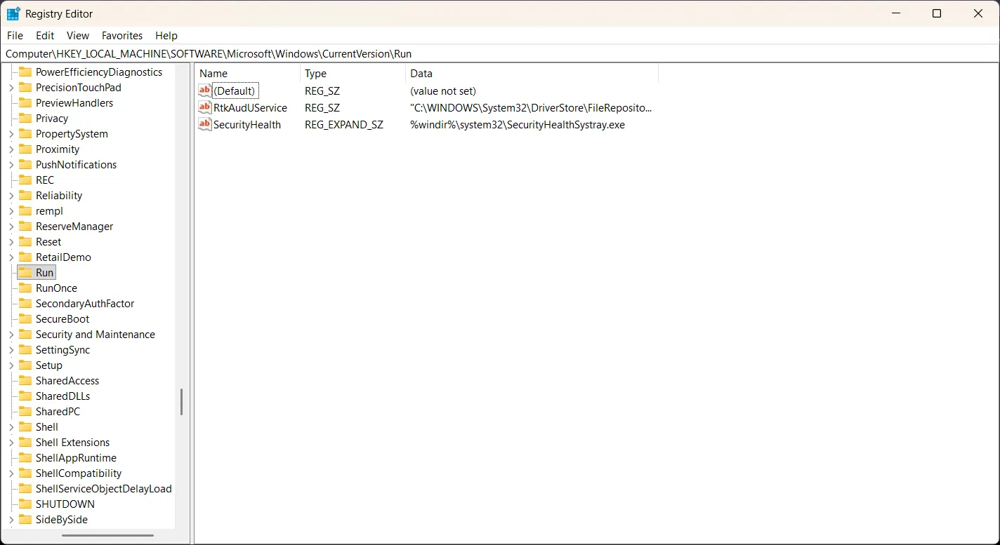
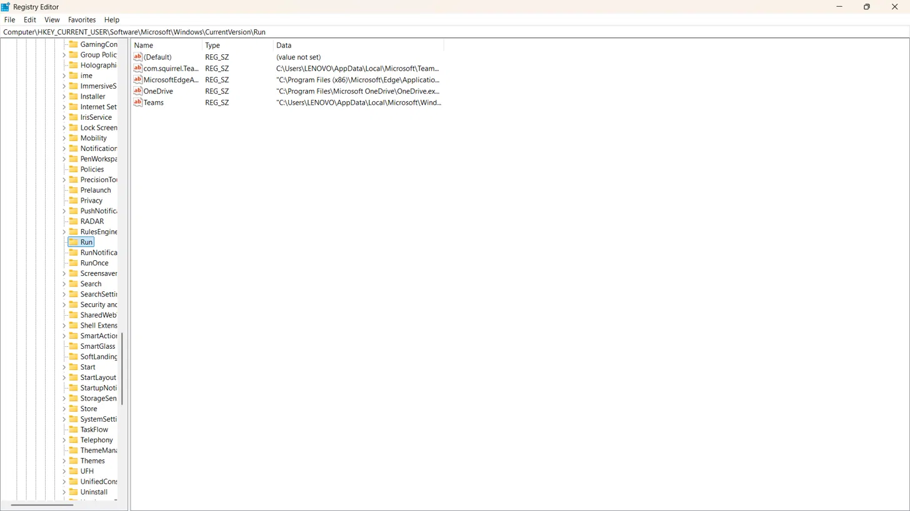
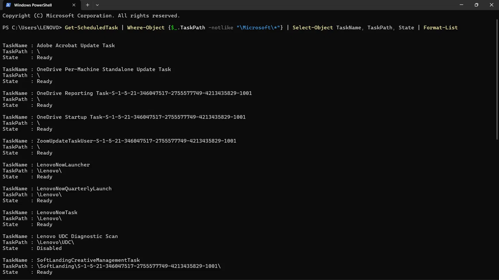
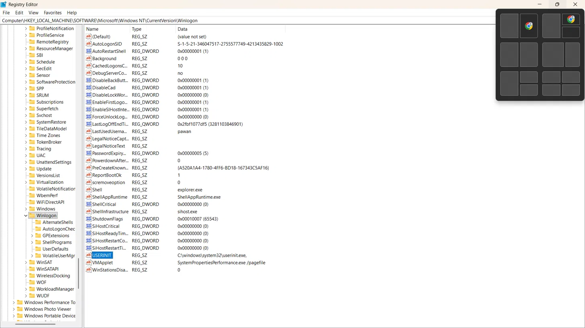

# Day 4: Windows Registry & Persistence Mechanisms 🔐

## Overview 📝
Investigated the Windows Registry as a persistence platform — how attackers 
abuse autostart locations to survive reboots, the privilege trade-offs between 
key locations, and how defenders detect registry-based persistence through 
log analysis and tooling. Verified live registry state on a real Windows system.

---

## What the Registry Is

A hierarchical database storing OS, hardware, application, and user 
configuration. Nearly everything that runs or starts on Windows has a 
registry entry somewhere.

### Five Root Hives

| Hive | Abbreviation | Contains |
|---|---|---|
| `HKEY_LOCAL_MACHINE` | HKLM | System-wide settings, hardware, installed software |
| `HKEY_CURRENT_USER` | HKCU | Settings for the currently logged-in user |
| `HKEY_CLASSES_ROOT` | HKCR | File associations, COM objects |
| `HKEY_USERS` | HKU | All user profiles loaded on the system |
| `HKEY_CURRENT_CONFIG` | HKCC | Current hardware profile |

---

## The Persistence Problem

Injection (Day 3) gives execution and stealth, but payload lives only in 
memory — a reboot destroys it. Persistence solves one problem:
*how does malicious code survive a reboot without the user re-launching it?*

The registry is the most common answer.

---

## Key Persistence Locations

### Run & RunOnce Keys — Most Common
```
HKLM\SOFTWARE\Microsoft\Windows\CurrentVersion\Run        ← all users, admin required
HKLM\SOFTWARE\Microsoft\Windows\CurrentVersion\RunOnce
HKCU\SOFTWARE\Microsoft\Windows\CurrentVersion\Run        ← current user only, no admin needed
HKCU\SOFTWARE\Microsoft\Windows\CurrentVersion\RunOnce
```

**HKCU vs HKLM trade-off:**

| | HKCU | HKLM |
|---|---|---|
| Privileges needed | None (user-level) | Admin |
| Scope | Current user only | All users |
| UAC triggered | No | Yes |
| Attacker preference | Low-priv malware | Post-escalation malware |

Key SOC insight: a phishing payload running entirely in user context can 
achieve reliable persistence via HKCU without ever triggering UAC or 
requiring privilege escalation.

### Services — Highest Privilege Persistence
```
HKLM\SYSTEM\CurrentControlSet\Services\
```
Starts at boot before any user logs in. Runs as SYSTEM. Requires admin to 
write — but gives the most reliable, highest-privilege persistence available.

### Image File Execution Options (IFEO) — Stealthy Hijack
```
HKLM\SOFTWARE\Microsoft\Windows NT\CurrentVersion\Image File Execution Options\
```
Legitimate purpose: attach a debugger to a process at launch for development.
Abuse: attacker sets a `Debugger` value pointing to malware for any common 
executable. Every time the victim opens that program, the attacker's binary 
runs instead.

Detection: unexpected `Debugger` values on non-development machines under 
any common utility (notepad.exe, calc.exe, etc.).

### Winlogon — Logon-Triggered Persistence
```
HKLM\SOFTWARE\Microsoft\Windows NT\CurrentVersion\Winlogon\Userinit
```
Specifies programs Windows runs when a user logs on.
Default (clean) value: `C:\windows\system32\userinit.exe,`
Abuse: malware appends a path after the comma:
`userinit.exe,C:\malware.exe`
Any deviation from the default is an immediate alert — confirmed clean on 
my system (see screenshot).

### AppInit_DLLs — Legacy DLL Persistence
```
HKLM\SOFTWARE\Microsoft\Windows NT\CurrentVersion\Windows\AppInit_DLLs
```
Any DLL listed here loads into every process using `User32.dll`.
Disabled by default on modern Windows with Secure Boot — still relevant 
for legacy environments.

---

## Scheduled Tasks — Registry's Close Cousin

Not in the registry but functionally identical from a persistence standpoint.

```
C:\Windows\System32\Tasks\
C:\Windows\SysWOW64\Tasks\
```

Managed via `schtasks` command. Enumerated in PowerShell:
```powershell
Get-ScheduledTask | Where-Object {$_.TaskPath -notlike "\Microsoft\*"} | 
Select-Object TaskName, TaskPath, State | Format-List
```

**Triage notes from live system:**
- Adobe, OneDrive, Zoom, Lenovo tasks — all expected for installed software
- SID-suffixed OneDrive tasks (e.g. `Task-S-1-5-21-346047517...`) — normal, 
  Microsoft appends user SID to scope per-user tasks
- `SoftLandingCreativeManagementTask` — unfamiliar name, worth checking 
  the actual executable path before clearing
- `Lenovo UDC Diagnostic Scan` — state: Disabled, lower priority to 
  investigate than active tasks

---

## Practical Evidence 🧪

<details>
<summary>🪟 HKLM\...\Run — System-wide Autostart Entries</summary>



Entries present:
- `RtkAudioService` → `C:\WINDOWS\System32\DriverStore\FileReposito...`
  (Realtek audio driver component — expected)
- `SecurityHealth` → `%windir%\system32\SecurityHealthSystray.exe`
  (Windows Security tray icon — expected)

Both entries point to System32/DriverStore paths and are associated with 
known Windows components. Clean baseline confirmed.
</details>

<details>
<summary>👤 HKCU\...\Run — Current User Autostart Entries</summary>



Entries present:
- `com.squirrel.Teams...` → `C:\Users\LENOVO\AppData\Local\Microsoft\Team...`
- `MicrosoftEdgeA...` → `C:\Program Files (x86)\Microsoft\Edge\Applicatio...`
- `OneDrive` → `C:\Program Files\Microsoft OneDrive\OneDrive.ex...`
- `Teams` → `C:\Users\LENOVO\AppData\Local\Microsoft\Wind...`

All entries correspond to expected Microsoft/productivity applications. 
HKCU entries require no admin privileges to write — this is exactly the 
location low-privilege malware would target for persistence.
</details>

<details>
<summary>💻 Non-Microsoft Scheduled Tasks — PowerShell Enumeration</summary>



Command:
```powershell
Get-ScheduledTask | Where-Object {$_.TaskPath -notlike "\Microsoft\*"} | 
Select-Object TaskName, TaskPath, State | Format-List
```

Tasks identified: Adobe Acrobat Update, OneDrive (multiple, SID-scoped), 
Zoom, Lenovo (Launcher/QuarterlyLaunch/Task/UDC Diagnostic Scan — Disabled), 
SoftLandingCreativeManagementTask.

`SoftLandingCreativeManagementTask` flagged for follow-up: unfamiliar 
vendor name, would verify executable path and publisher before clearing.
</details>

<details>
<summary>🔬 Winlogon\Userinit — Bonus: Research Location Verified Live</summary>



Path: `HKLM\SOFTWARE\Microsoft\Windows NT\CurrentVersion\Winlogon`
`USERINIT` value: `C:\windows\system32\userinit.exe,`

Clean default confirmed — trailing comma present, no additional executable 
appended. Deviation from this value (e.g. `userinit.exe,C:\malware.exe`) 
is a high-confidence persistence indicator. Autoruns monitors this location 
as part of its logon autostart checks.
</details>

---

## SOC Detection 🛡️

| Signal | Log Source | What to Look For |
|---|---|---|
| Registry write to Run keys | Sysmon Event ID 13 | Non-installer, unsigned process writing to `...\Run` |
| Registry write (with auditing) | Event ID 4657 | Requires Object Access auditing — off by default |
| New service created | Event ID 7045 | Binary path outside System32 |
| Scheduled task created | Event ID 4698 | Task created by cmd.exe/powershell.exe/wscript.exe |
| IFEO Debugger value | Sysmon Event ID 13 | Any Debugger entry under IFEO for non-dev machines |

**Autoruns** (Sysinternals) — enumerates every persistence location 
simultaneously and flags entries not signed by Microsoft. First tool to 
run on a suspected infected host.

---

## MITRE ATT&CK Mapping 🗺️

| Technique ID | Name |
|---|---|
| T1547.001 | Registry Run Keys / Startup Folder |
| T1543.003 | Windows Service |
| T1546.012 | Image File Execution Options Injection |
| T1053.005 | Scheduled Task |

---

## Key Takeaways 🎯
- The registry is the primary persistence platform on Windows — knowing the 
  autostart locations cold is a baseline SOC skill
- HKCU Run requires zero privileges — low-priv malware can achieve persistent 
  execution without ever triggering UAC or escalating
- IFEO abuse turns a legitimate debugging feature into a silent execution 
  hijack — unexpected Debugger values on production machines are high-confidence
- Winlogon\Userinit deviation from `userinit.exe,` (the trailing comma is 
  the clean default) is an immediate persistence indicator
- Sysmon Event ID 13 is the practical detection mechanism — standard Windows 
  auditing for registry changes is off by default
- Persistence connects Day 3 and Day 4: injection gives stealth, 
  registry gives survival across reboots
