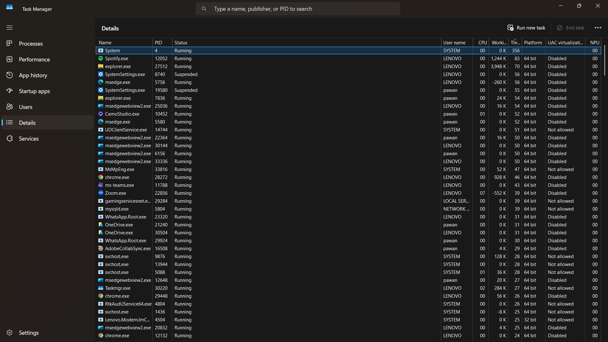
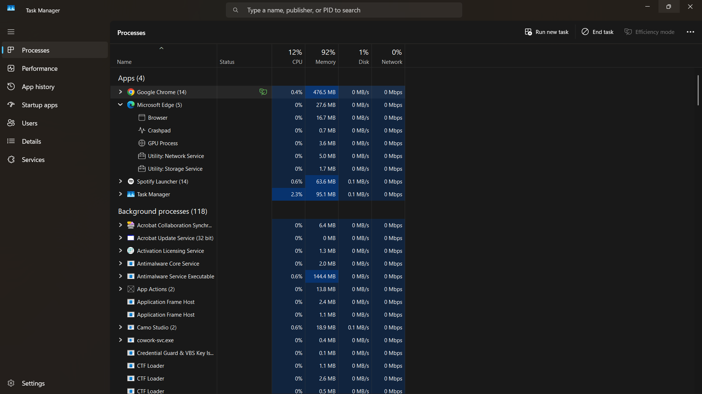

# 🧠 Day 4 — OS Internals: Processes, Threads, and Memory Management

**Phase:** 0 — Computer Fundamentals
**Score:** 10/10 ✅

---

## 🎯 Learning Objectives

- Understand the difference between a process and a thread
- Learn how context switching creates the illusion of simultaneous execution
- Understand why process memory isolation matters for security
- Learn the standard process states
- Research how Windows APIs are abused for credential dumping

---

## 📚 Topics Covered

| Topic | Description |
|---|---|
| Process vs. Thread | Independent memory unit vs. smallest execution unit sharing parent memory |
| Context switching | CPU rapidly alternates between processes/threads |
| Memory isolation | Security boundary between processes |
| Process states | Running, Ready, Waiting/Blocked, Suspended, Terminated |
| Credential dumping APIs | OpenProcess, ReadProcessMemory |

---

## 🔑 Key Concepts

**Process vs. thread:** A **process** is an independent unit with its own allocated memory space. A **thread** is the smallest unit of execution, and multiple threads within the same process share that process's memory.

**Context switching:** The CPU rapidly switches between processes/threads, giving the appearance of simultaneous execution — even on a single core.

> 💡 **Why this matters for SOC work:** Process memory isolation is the exact security boundary that **process injection attacks** (Day 2 territory) are designed to bypass. Understanding the boundary is a prerequisite to understanding how it's broken.

**Process states:** Running, Ready, Waiting/Blocked, Suspended, Terminated — the lifecycle every process moves through on a system.

---

## 🛠️ Practical Work

Explored Windows Task Manager's **Details** tab (sorted by Threads column) and **Processes** tab (expanded parent/child process trees).

- Highest thread count observed: **System** process at 356 threads — expected, since `System` (PID 4) is the kernel process and aggregates numerous kernel-mode threads across the OS
- Among user-facing/background apps, `Spotify.exe` (83 threads) and `explorer.exe` (70 threads) had the next-highest counts
- `svchost.exe` appeared multiple times (~28 threads each) — it commonly hosts multiple Windows background services within a single shared process, which is also why it's a frequent target for malware impersonation/injection, since its "busy," repeated presence looks unremarkable
- Parent/child example: Microsoft Edge (parent) with child processes for Browser, Crashpad, GPU Process, Utility: Network Service, and Utility: Storage Service — each handling a distinct function independently, reflecting modern multi-process browser architecture

📸 Task Manager — Details Tab, Threads Column (click to expand)

📸 Task Manager — Processes Tab, Parent/Child Tree (click to expand)

---

## 🔍 Research Findings — Credential Dumping APIs

Investigated `OpenProcess` and `ReadProcessMemory`, two Windows APIs:

- **OpenProcess** — obtains a handle/reference to another running process
- **ReadProcessMemory** — reads memory from another process, given sufficient access rights

Both are legitimate APIs used by debuggers, antivirus engines, and monitoring tools. Security tools flag their use by unrecognized processes because attackers use this exact API pattern to dump credentials from `lsass.exe` — the classic credential-dumping technique used by tools like Mimikatz.

---

## 🧰 Tools Used

- Windows Task Manager (Details tab, Processes tab)

---

## 💡 Key Takeaways

1. Process/thread architecture isn't abstract OS theory — it directly explains why certain processes (like `svchost.exe`) are common malware disguise targets.
2. Memory isolation is a security boundary, not just a resource-management feature — and attackers specifically design techniques to violate it.
3. The same APIs used by legitimate tools (debuggers, AV) are exactly what attackers repurpose for credential theft — intent, not the API itself, is what security tools must infer.

---

## ➡️ What's Next — Day 5

*(Fill in once Day 5 topic is assigned)*

---
