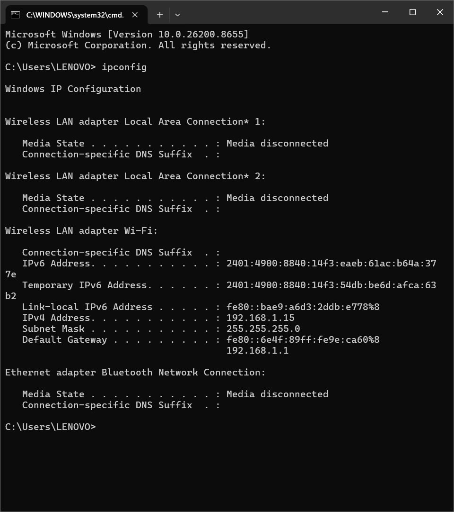
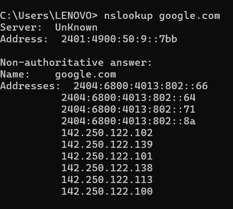
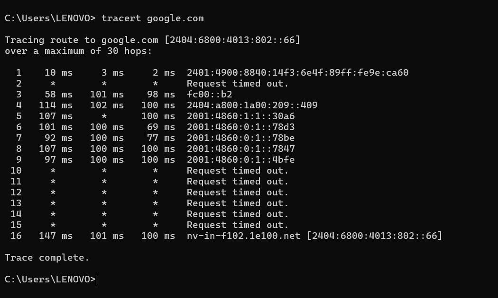

# 🌐 Day 5 — The Client-Server Model & How the Internet Works

**Phase:** 0 — Computer Fundamentals
**Score:** 10/10 ✅

---

## 🎯 Learning Objectives

- Understand the client-server communication model
- Learn the full DNS resolution flow behind a web request
- Understand private vs. public IP addressing and why it matters for security
- Use `ipconfig`, `nslookup`, and `tracert` to inspect real network behavior
- Research DNS tunneling as a data exfiltration technique

---

## 📚 Topics Covered

| Topic | Description |
|---|---|
| Client-server model | Request/response pattern between devices and services |
| DNS resolution | Domain name → IP address translation |
| Private vs. public IP | Local-network-only vs. internet-reachable addressing |
| Network diagnostics | `ipconfig`, `nslookup`, `tracert` |
| DNS tunneling | Covert data channel hidden inside DNS traffic |

---

## 🔑 Key Concepts

**Client-server model:** A **client** is any device or application that requests data or services. A **server** receives, processes, and responds to that request. This applies beyond web browsing — e.g., the Spotify desktop app (client) requesting music from Spotify's servers.

**DNS resolution flow (example: github.com):**
1. **DNS Lookup** — resolve `github.com` to an IP address
2. **Connection** — establish a TCP/TLS connection with the server
3. **HTTP(S) Request** — browser requests the page
4. **Response** — server returns HTML, CSS, JS, images
5. **Rendering** — browser displays the page

**Private vs. public IP addresses:**
- **Private IP** — used only within a local network, not reachable from the internet, shielded via **NAT** (Network Address Translation)
- **Public IP** — assigned by an ISP, directly reachable from the internet, and therefore constantly probed by automated scanners for open ports or vulnerable services

> 💡 **Why this matters for SOC work:** A huge volume of SOC alerts — port scans, brute-force attempts — originate simply because a public-facing IP is exposed and scannable by anyone. Firewalls, patching, and access controls exist specifically to defend that exposed surface.

---

## 🛠️ Practical Work

### 1. Local IP Configuration (`ipconfig`)

Used the **ipconfig** command in Windows Command Prompt to inspect my system's network configuration.

**Observed:**
- IPv4 Address
- IPv6 Address
- Subnet Mask
- Default Gateway

I verified that my device was assigned a **private IPv4 address**, confirming that it communicates within a local network while being protected through NAT.

<strong>📸 ipconfig Output (Click to Expand)</strong>

 

---

### 2. DNS Resolution (`nslookup google.com`)

Executed the **nslookup** command to resolve Google's domain name.

The command returned multiple IPv4 and IPv6 addresses, demonstrating how DNS translates human-readable domain names into machine-readable IP addresses and how large-scale services distribute traffic across multiple servers.

<strong>📸 nslookup Output (Click to Expand)</strong>

 

---

### 3. Network Path Tracing (`tracert google.com`)

Executed the **tracert** command to trace the route packets travel from my computer to Google's servers.

The output displayed each intermediate router (hop) involved in forwarding traffic. Some hops returned **"Request timed out"**, which is expected because many routers intentionally ignore traceroute requests while still forwarding network traffic.

<strong>📸 tracert Output (Click to Expand)</strong>

 

---

## 🔍 Research Findings — DNS Tunneling

DNS tunneling is a technique that hides data within DNS queries and responses, creating a covert communication channel. Attackers exploit DNS because it is commonly trusted by firewalls and security devices, allowing malicious traffic to bypass traditional security controls and potentially exfiltrate sensitive information.

---

## 🧰 Tools Used

- Windows Command Prompt
- `ipconfig`
- `nslookup`
- `tracert`

---

## 💡 Key Takeaways

1. The client-server model forms the foundation of modern network communication.
2. DNS translates domain names into IP addresses before any connection can be established.
3. Private IP addresses remain protected inside local networks through NAT, while public IP addresses require additional security controls because they are exposed to the internet.
4. Traceroute helps visualize the path packets take across multiple routers before reaching their destination.
5. DNS traffic can be abused for covert communication, making DNS monitoring an important responsibility for SOC Analysts.

---

## ➡️ What's Next — Phase 1: Networking Fundamentals

Building upon these computer fundamentals, the next phase focuses on networking concepts in greater depth, including network protocols, packet analysis, routing, switching, and the practical skills required for Security Operations Center (SOC) analysis.
