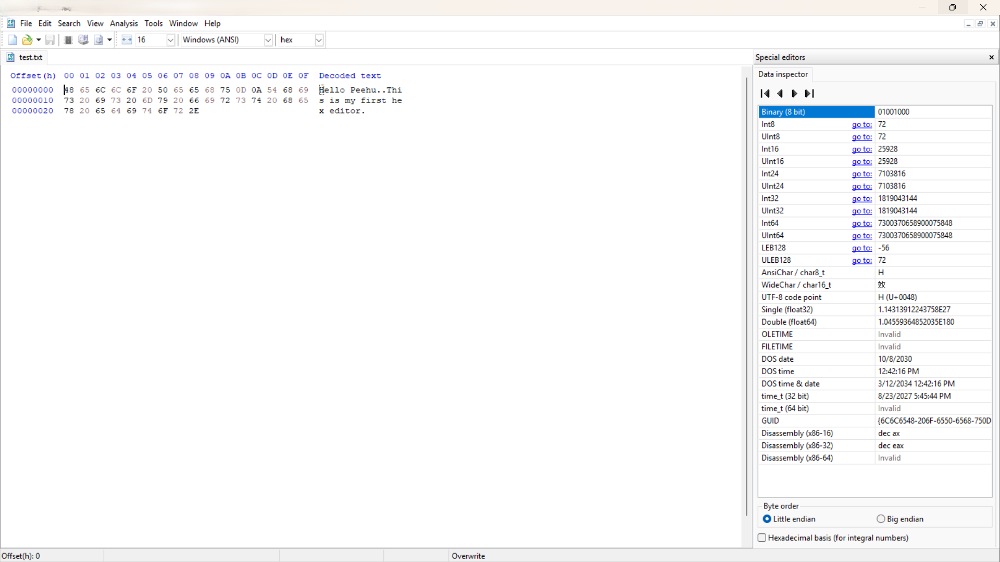

# 🧮 Day 2 — Binary, Hexadecimal & ASCII

**Phase:** 0 — Computer Fundamentals
**Score:** 10/10 ✅

---

## 🎯 Learning Objectives

- Convert manually between binary, decimal, and hexadecimal
- Understand how ASCII maps characters to numeric values
- Use a hex editor to inspect raw byte data in a real file
- Learn how file signatures ("magic numbers") identify true file type

---

## 📚 Topics Covered

| Topic | Description |
|---|---|
| Binary ↔ Decimal | Place-value method |
| Binary ↔ Hexadecimal | Nibble-splitting (4 bits = 1 hex digit) |
| ASCII encoding | Character-to-number mapping |
| Hex editors | Reading raw bytes with HxD |
| File signatures | Identifying true file type via header bytes |

---

## 🔑 Key Concepts

**Nibble-splitting:** Every hex digit represents exactly 4 binary bits. Splitting a byte into two nibbles (high 4 bits, low 4 bits) makes binary-to-hex conversion fast without long division.

**ASCII example:** `Z` = `90` decimal = `5A` hex — every printable character has a fixed numeric identity, which is why text files are really just sequences of numbers interpreted as characters.

**File signatures:** A file's true type is determined by its first bytes, not its extension. `4D 5A` ("MZ") at offset 0 marks a Windows PE executable (.exe/.dll), regardless of what the file is renamed to.

> 💡 **Why this matters for SOC work:** Malware is frequently disguised with a fake extension (e.g. `invoice.pdf.exe` or a renamed executable). Analysts verify true file type by checking the header bytes directly — not the filename. Hex/byte literacy is the foundation for reading packet captures, memory dumps, and disk forensics later in this roadmap.

---

## 🛠️ Practical Work

- Completed 5 manual binary/decimal/hex conversion exercises by hand
- Installed **HxD** (free hex editor) and opened a test `.txt` file
- Verified hex byte `48` correctly decoded to ASCII `H`, confirming manual conversion work against a real tool
- Used HxD's Data Inspector panel to cross-check byte interpretation (Int8, UInt8, AnsiChar, UTF-8 code point)

📸 HxD Hex/ASCII View (click to expand)

---

## 🔍 Research Findings

Researched common file signatures beyond MZ, including PNG (`89 50 4E 47`), PDF (`25 50 44 46`), and ZIP (`50 4B 03 04`). Confirmed this is a foundational technique used in malware triage and static file analysis, before any dynamic/behavioral analysis takes place.

---

## 🧰 Tools Used

- **HxD** — free hex/disk editor
- Manual calculation (pen & paper) for conversion drills

---

## 💡 Key Takeaways

1. Binary/hex/ASCII aren't abstract math — they're the literal language every file and packet is written in.
2. File extensions are cosmetic and untrustworthy; header bytes are the ground truth.
3. Hands-on verification (HxD confirming manual math) builds real confidence, not just theoretical understanding.

---

## ➡️ What's Next — Day 3

*(Fill in once Day 3 topic is assigned)*

---
