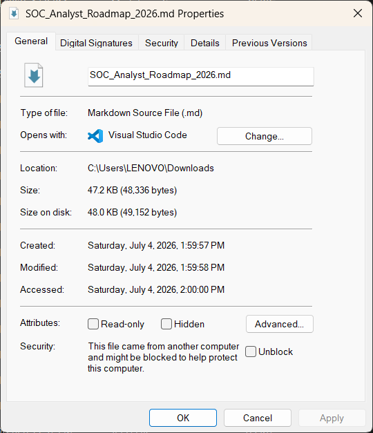
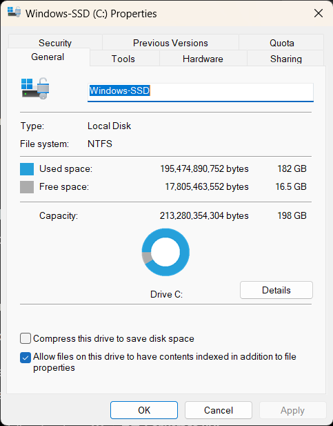

# 🗂️ Day 3 — File Systems & File Metadata

**Phase:** 0 — Computer Fundamentals
**Score:** 10/10 ✅

---

## 🎯 Learning Objectives

- Understand the differences between FAT32, NTFS, and ext4 file systems
- Learn why NTFS is the most forensically significant file system
- Understand the three MAC times and what each one records
- Learn what actually happens when a file is "deleted"
- Research anti-forensic timestamp manipulation ("timestomping")

---

## 📚 Topics Covered

| Topic | Description |
|---|---|
| FAT32 | Legacy file system, minimal metadata, no permissions |
| NTFS | Windows-native, maintains Master File Table (MFT) with rich metadata |
| ext4 | Common Linux file system |
| MAC times | Modified, Accessed, Created timestamps |
| File deletion | Directory entry removal vs. actual data erasure |
| Timestomping | Anti-forensic timestamp manipulation |

---

## 🔑 Key Concepts

**Why NTFS matters for forensics:** NTFS maintains a **Master File Table (MFT)** — a database-like structure recording metadata, permissions, and timestamps for every file on the volume. This gives investigators significantly more evidence to work with than FAT32, which stores minimal metadata and has no built-in permission system.

**MAC times:**
| Timestamp | Meaning |
|---|---|
| **M**odified | Last time file *content* was changed |
| **A**ccessed | Last time file was opened/read |
| **C**reated | When the file was first created on this volume |

**Deletion isn't erasure:** When a file is deleted on NTFS, the operating system removes the *directory entry/reference* to it — the underlying data on disk remains until it's overwritten by new data. This is why deleted files are often recoverable, and why forensic tools can reconstruct file remnants during an investigation.

> 💡 **Why this matters for SOC work:** Understanding MAC times lets an analyst build a timeline of attacker activity — when a malicious file was dropped, last modified, or last executed. Because deleted files remain recoverable until overwritten, drive imaging is a standard first step in incident response, before further activity risks destroying evidence.

**Timestomping:** An anti-forensic technique where an attacker deliberately alters a file's MAC timestamps (including the MFT's extended "Changed" metadata, part of the broader MACB timestamp set) to make a malicious file blend in with legitimate system files — for example, backdating a malware dropper to match the OS installation date. This is designed specifically to disrupt incident timeline reconstruction and mislead investigators.

---

## 🛠️ Practical Work

- Opened a file's **Properties → Details** tab and confirmed Created, Modified, and Accessed timestamps followed correct logical order (Created → Modified → Accessed)
- Verified the C: drive's file system is **NTFS** via Drive Properties

📸 File Properties — MAC Timestamps (click to expand)

📸 C: Drive Properties — NTFS File System (click to expand)

---

## 🔍 Research Findings

Timestomping is a known technique used in real-world intrusions to defeat basic timeline analysis. Investigators counter this by cross-referencing MFT metadata (like `$STANDARD_INFORMATION` vs. `$FILE_NAME` attribute timestamps) — a mismatch between these two often reveals that timestamps were tampered with, even when the visible Properties dialog looks normal.

---

## 🧰 Tools Used

- Windows File Explorer (Properties → Details tab)
- Windows Drive Properties dialog

---

## 💡 Key Takeaways

1. File systems aren't just storage formats — NTFS's metadata richness is *why* Windows systems are forensically valuable.
2. "Deleted" doesn't mean "gone" — this single fact underpins a large part of digital forensics.
3. Attackers actively exploit metadata (timestomping) to evade detection, meaning analysts must know how to spot manipulation, not just read timestamps at face value.

---

## ➡️ What's Next — Day 4

*(Fill in once Day 4 topic is assigned)*

---
